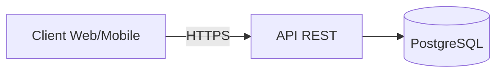

# Exercices — Module 1 Fondamentaux

Durée estimée : **6 à 8 heures** (répartissables sur la semaine 1 du [planning](../../docs/planning.md)).

---

## Exercice 1 — Questions de clarification (30 min)

Pour chaque scénario, listez **5 questions** à poser au client / product owner avant de proposer une architecture.

### Scénario A : Application de réservation de taxis

Exemple de bonne question : « Combien de courses simultanées au pic ? »

<details>
<summary>Exemples de réponses attendues</summary>

- Quel délai maximum pour trouver un chauffeur ?
- Couverture géographique (une ville, un pays, mondial) ?
- Besoin de suivi temps réel (WebSocket) ?
- Mode offline ou uniquement connecté ?
- Réglementation (données personnelles, paiement) ?

</details>

### Scénario B : Plateforme de formation en ligne (type MOOC)

### Scénario C : API interne de gestion des stocks pour 50 magasins

**Livrable :** un fichier `clarification-questions.md` (ou section dans votre carnet) avec vos questions pour les 3 scénarios.

---

## Exercice 2 — Estimation de charge (45 min)

### Énoncé

Concevez les ordres de grandeur pour une **API de blog** :

- 500 000 lecteurs actifs / mois
- Chaque lecteur consulte 10 articles / mois
- Ratio lecture / écriture : 100:1
- Taille moyenne d'un article : 5 Ko (texte + métadonnées)
- 2 000 auteurs actifs, chacun publie 4 articles / mois

### À calculer

1. Requêtes de lecture par seconde (moyenne et pic à 3×)
2. Requêtes d'écriture par seconde
3. Stockage total des articles après 1 an
4. Bande passante sortante estimée (lectures uniquement)

### Template de réponse

```text
Lectures / mois     = ...
Lectures / sec      = ... (moyenne), ... (pic)
Écritures / sec     = ...
Stockage 1 an       = ...
Bande passante pic  = ...
```

<details>
<summary>Solution indicative</summary>

```text
Lectures / mois     = 500 000 × 10 = 5 000 000
Lectures / sec      = 5M / (30 × 86400) ≈ 1,9 req/s (moyenne), ~6 req/s (pic)
Écritures / mois    = 2 000 × 4 = 8 000 articles
Écritures / sec     = 8 000 / (30 × 86400) ≈ 0,003 req/s (négligeable)
Stockage 1 an       = 8 000 × 12 × 5 Ko ≈ 480 Mo
Bande passante pic  = 6 req/s × 5 Ko ≈ 30 Ko/s (très faible)

Conclusion : un monolithe + PostgreSQL + cache optionnel suffit largement.
```

</details>

---

## Exercice 3 — CAP et ACID/BASE (45 min)

Pour chaque cas, indiquez :

- **CAP** : CP ou AP (en cas de partition)
- **ACID ou BASE**
- **Justification** en 2–3 phrases

| Cas | CAP | ACID/BASE | Votre justification |
| --- | --- | --------- | ------------------- |
| Fil de commentaires sur un réseau social | | | |
| Traitement d'un paiement par carte | | | |
| Tableau de bord analytics (données J-1) | | | |
| Système de messagerie instantanée | | | |
| Registre des commandes e-commerce | | | |

<details>
<summary>Corrigé indicatif</summary>

| Cas | CAP | ACID/BASE |
| --- | --- | ---------  |
| Commentaires | AP | BASE — délai d'affichage acceptable |
| Paiement | CP | ACID — incohérence = perte financière |
| Analytics J-1 | AP | BASE — données non temps réel |
| Messagerie | AP | BASE — disponibilité prioritaire, ordre approximatif |
| Commandes | CP | ACID — stock et commande doivent être cohérents |

</details>

---

## Exercice 4 — Monolithe ou microservices ? (30 min)

Pour chaque situation, choisissez **monolithe**, **monolithe modulaire** ou **microservices** et justifiez.

1. Startup MVP, 3 développeurs, produit à valider en 3 mois
2. Plateforme e-commerce, 80 développeurs, pics Black Friday, équipes par domaine (catalogue, paiement, logistique)
3. Application interne RH, 200 utilisateurs, 2 développeurs
4. Service de streaming vidéo avec encodage, catalogue, facturation, recommandations

**Format de réponse :**

```text
Situation 1 : [choix] — parce que ...
```

---

## Exercice 5 — Fiche synthèse des compromis (1 h)

**Livrable obligatoire du module.**

Complétez la fiche ci-dessous. Vous pouvez la copier dans un fichier `trade-offs-summary.md` dans ce dossier.

```markdown
# Fiche synthèse — Compromis System Design

## Scalabilité
| Approche | Quand l'utiliser | Risque principal |
| -------- | ---------------- | ----------------  |
| Verticale | | |
| Horizontale | | |

## Données
| Modèle | Quand l'utiliser | Risque principal |
| ------ | ---------------- | ----------------  |
| ACID | | |
| BASE | | |

## Architecture
| Style | Quand l'utiliser | Risque principal |
| ----- | ---------------- | ----------------  |
| Monolithe | | |
| Microservices | | |

## CAP (lors d'une partition)
| Choix | Quand l'utiliser | Exemple métier |
| ----- | ---------------- | --------------  |
| CP | | |
| AP | | |

## Performance
| Priorité | Quand | Technique clé |
| -------- | ----- | -------------  |
| Latence | | |
| Throughput | | |

## Disponibilité
| Niveau SLA | Coût / complexité | Exemple de système |
| ---------- | ----------------- | -----------------  |
| 99,9 % | | |
| 99,99 % | | |
```

---

## Exercice 6 — Design d'une API REST (2–3 h)

**Livrable obligatoire du module.**

### Contexte

Vous concevez l'API d'un **système de gestion de tâches** (type Todo list partagée) pour une petite équipe :

- Utilisateurs pouvant créer des listes de tâches
- Tâches avec titre, description, statut (`todo`, `in_progress`, `done`), date d'échéance
- Partage de listes entre utilisateurs (lecture seule ou édition)
- Volume attendu : 5 000 utilisateurs, pic 50 req/s

### Partie A — Spécification API

Définissez au minimum :

1. **Ressources** et relations (Users, Lists, Tasks, …)
2. **Endpoints REST** (méthode, URL, description)
3. **Exemples de payload** JSON (création tâche, liste des tâches)
4. **Codes HTTP** utilisés et cas d'erreur (401, 403, 404, 409)
5. **Contraintes NFR** que vous imposez (latence, auth)

#### Template endpoints

| Méthode | Endpoint | Description |
| ------- | -------- | -----------  |
| POST | `/api/v1/...` | |
| GET | `/api/v1/...` | |
| ... | | |

### Partie B — Diagramme d'architecture

Produisez un **diagramme simple** (Draw.io, Excalidraw ou Mermaid) montrant :

- Client (web / mobile)
- API REST
- Base de données
- Éventuellement cache (justifiez si présent ou absent)

Exemple minimal en Mermaid (à adapter et enrichir) :



### Partie C — Justification des choix (10 lignes minimum)

Répondez par écrit :

1. Monolithe ou microservices ? Pourquoi ?
2. SQL ou NoSQL ? Pourquoi ?
3. Cache nécessaire à ce stade ? Pourquoi ?
4. Comment garantissez-vous l'authentification (conceptuellement) ?

<details>
<summary>Piste de correction (non unique)</summary>

- **Monolithe** : volume modeste, domaine simple, une équipe
- **PostgreSQL** : relations Users ↔ Lists ↔ Tasks, transactions ACID pour le partage
- **Pas de cache** initial : 50 req/s ne le justifie pas ; ajouter Redis si la latence augmente
- **Auth** : JWT ou session via OAuth2 / Entra ID ; contrôle d'accès sur chaque liste (RBAC simple)

Endpoints exemple :

- `POST /api/v1/lists` — créer une liste
- `GET /api/v1/lists/{id}/tasks` — lister les tâches
- `PATCH /api/v1/tasks/{id}` — changer le statut
- `POST /api/v1/lists/{id}/shares` — partager avec un utilisateur

</details>

---

## Exercice 7 — Design review (30 min)

Échangez avec un pair (ou auto-évaluation) sur votre API du exercice 6 :

1. Les endpoints sont-ils cohérents et RESTful ?
2. Avez-vous identifié un SPOF ?
3. Le design tient-il la charge annoncée (50 req/s) ?
4. Que se passe-t-il si la base de données est indisponible 5 minutes ?

Utilisez la [checklist de design review](../../templates/design-review-checklist.md) si disponible.

---

## Livrables à rendre

| Fichier | Exercice | Obligatoire |
| ------- | -------- | -----------  |
| `trade-offs-summary.md` | 5 | Oui |
| `api-design.md` (spec + justification) | 6A + 6C | Oui |
| `architecture-diagram` (.png, .drawio ou Mermaid dans le .md) | 6B | Oui |
| `clarification-questions.md` | 1 | Recommandé |

---

## Critères d'évaluation

| Critère | Attendu |
| ------- | -------  |
| Compromis | Chaque choix technique a un « pourquoi » |
| Chiffres | Au moins une estimation d'ordre de grandeur |
| API | Ressources claires, HTTP sémantique, erreurs gérées |
| Diagramme | Lisible, composants nommés, flux HTTPS |
| Réalisme | Pas de sur-ingénierie pour le volume donné |

---

## Suite

Module suivant : [02 — Architecture applicative avancée](../02-architecture/README.md)
