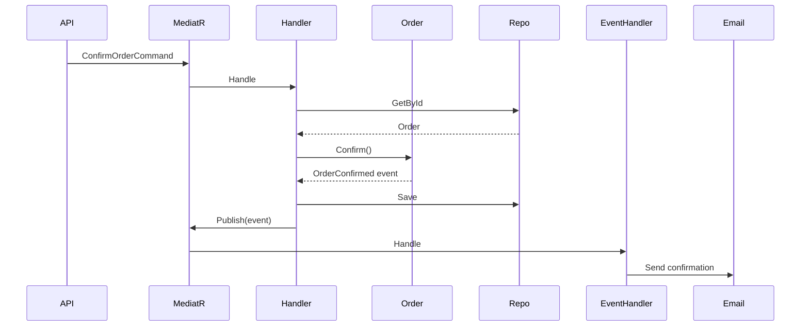
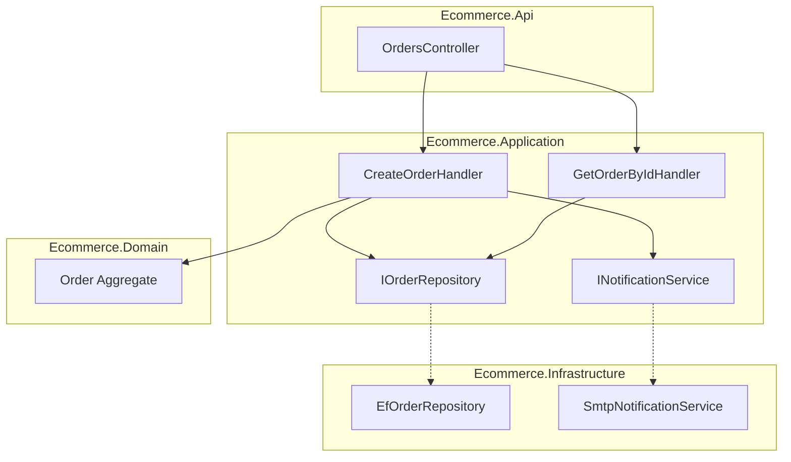

# Ateliers — Module 2 Architecture applicative

Durée estimée : **8 à 10 heures** (semaine 2 du [planning](../../docs/planning.md)).

---

## Atelier 1 — Audit de couplage et cohésion (1 h)

### Contexte

Vous héritez du code suivant (application e-commerce simplifiée, style « legacy ») :

```csharp
// OrdersController.cs — tout est dans le controller
[ApiController]
[Route("api/orders")]
public class OrdersController : ControllerBase
{
    private readonly AppDbContext _db;

    [HttpPost]
    public async Task<IActionResult> Create(CreateOrderRequest request)
    {
        var customer = await _db.Customers.FindAsync(request.CustomerId);
        if (customer == null) return NotFound();

        decimal total = 0;
        foreach (var item in request.Items)
        {
            var product = await _db.Products.FindAsync(item.ProductId);
            if (product.Stock < item.Quantity)
                return BadRequest("Insufficient stock");
            total += product.Price * item.Quantity;
            product.Stock -= item.Quantity;
        }

        if (total > customer.CreditLimit)
            return BadRequest("Credit limit exceeded");

        var order = new OrderEntity
        {
            CustomerId = request.CustomerId,
            Total = total,
            Status = "Created"
        };
        _db.Orders.Add(order);
        await _db.SaveChangesAsync();

        // Envoi email direct
        var smtp = new SmtpClient("smtp.company.com");
        await smtp.SendMailAsync(new MailMessage(
            "noreply@company.com", customer.Email,
            "Order confirmed", $"Total: {total}"));

        return Ok(order.Id);
    }
}
```

### Travail demandé

1. Listez **au moins 5 problèmes** (couplage, cohésion, testabilité, responsabilités)
2. Classez-les : **domaine**, **application**, **infrastructure**, **présentation**
3. Proposez la **structure de projets** cible (4 projets minimum)

<details>
<summary>Problèmes attendus (indicatif)</summary>

- Logique métier (stock, crédit, calcul total) dans le controller → cohésion faible
- Dépendance directe à `AppDbContext` et `SmtpClient` → couplage fort
- Impossible de tester la règle crédit sans BDD et SMTP
- Pas d'agrégat `Order` : anemic / entité passive
- Transaction implicite mélange persistance et règles métier
- Chaîne magique `"Created"` au lieu d'enum / value object

Structure cible :

```text
Ecommerce.Domain/
Ecommerce.Application/
Ecommerce.Infrastructure/
Ecommerce.Api/
```

</details>

---

## Atelier 2 — Refactoring vers Clean Architecture (3 h)

### Objectif

Refactorer le controller de l'atelier 1 vers une architecture en couches. Vous pouvez coder ou produire un **design détaillé** (classes, interfaces, responsabilités).

### Étape 1 — Domain

Créez (ou décrivez) :

| Élément | Exemple |
| ------- | ------- |
| Aggregate root | `Order` |
| Value objects | `Money`, `OrderStatus` |
| Domain exception | `InsufficientStockException` |
| Méthodes métier | `AddLine()`, `Confirm()` |

**Livrable partiel :** diagramme ou liste des classes du domaine avec leurs responsabilités.

### Étape 2 — Application

| Élément | Rôle |
| ------- | ---- |
| `CreateOrderCommand` | DTO d'entrée du cas d'usage |
| `CreateOrderHandler` | Orchestration |
| `IOrderRepository` | Port de persistance |
| `INotificationService` | Port d'envoi email |

### Étape 3 — Infrastructure

| Élément | Rôle |
| ------- | ---- |
| `EfOrderRepository` | Implémentation EF Core |
| `SmtpNotificationService` | Implémentation email |

### Étape 4 — API

Le controller ne fait plus qu'envoyer la commande :

```csharp
[HttpPost]
public async Task<IActionResult> Create(CreateOrderCommand command, CancellationToken ct)
{
    var orderId = await _mediator.Send(command, ct);
    return CreatedAtAction(nameof(GetById), new { id = orderId }, orderId);
}
```

### Critères de validation

- [ ] Le projet `Domain` ne référence aucun package infrastructure
- [ ] Les règles stock / crédit sont testables sans base de données
- [ ] Le controller a moins de 15 lignes par action
- [ ] Les interfaces sont définies côté Application

---

## Atelier 3 — Implémentation CQRS avec MediatR (2–3 h)

### Prérequis techniques

**Squelette fourni :** [`OrderApp/`](OrderApp/) — solution Clean Architecture déjà structurée.

```bash
cd modules/02-architecture/OrderApp
dotnet restore
dotnet build
dotnet test
dotnet run --project OrderApp.Api
```

Pour créer un projet from scratch :

```bash
dotnet new webapi -n OrderApp
cd OrderApp
dotnet add package MediatR
```

### Partie A — Commande (write)

Implémentez :

1. `CreateOrderCommand` + `CreateOrderHandler`
2. `ConfirmOrderCommand` + `ConfirmOrderHandler`

Chaque handler utilise `IOrderRepository`.

### Partie B — Requête (read)

Implémentez :

1. `GetOrderByIdQuery` + `GetOrderByIdHandler`
2. `ListOrdersByCustomerQuery` + handler

Retournez un **DTO de lecture** (`OrderReadDto`) distinct de l'entité domaine.

### Partie C — Validation

Ajoutez FluentValidation (optionnel) :

```bash
dotnet add package FluentValidation
dotnet add package FluentValidation.DependencyInjectionExtensions
```

### Questions de réflexion

1. Pourquoi `OrderReadDto` ≠ `Order` (entité domaine) ?
2. À quel moment séparerait-on la base de lecture de la base d'écriture ?
3. Comment gérer la cohérence si le read model est en retard ?

<details>
<summary>Pistes de réponse</summary>

1. Le DTO expose uniquement ce que l'API consomme ; l'entité protège les invariants
2. Quand les lectures dominent (> 10:1) ou que les requêtes nécessitent des jointures lourdes / vues dénormalisées
3. Eventual consistency acceptable côté UI ; invalidation cache ; message « mise à jour en cours »

</details>

---

## Atelier 4 — Domain Events (1 h)

Sans event sourcing complet, ajoutez des **domain events** :

```csharp
public record OrderConfirmed(Guid OrderId, DateTime ConfirmedAt) : IDomainEvent;
```

1. L'agrégat `Order` lève l'événement dans `Confirm()`
2. Un `OrderConfirmedHandler` (MediatR `INotificationHandler`) envoie l'email
3. Dessinez le flux : Command → Handler → Aggregate → Event → NotificationHandler

**Diagramme Sequence attendu** (Mermaid accepté) :



---

## Atelier 5 — Diagrammes d'architecture (2 h)

**Livrables obligatoires du module.**

### Diagramme Component

Produisez un diagramme (Draw.io, Excalidraw ou Mermaid) au niveau **Component** montrant :

- `OrdersController` / API
- Handlers (Commands / Queries)
- Domain (`Order`, services domaine)
- `IOrderRepository`, `INotificationService`
- Implémentations infrastructure (EF, SMTP)

Exemple Mermaid :



### Diagramme Sequence

Choisissez **un flux complet** (création ou confirmation de commande) et documentez :

- Acteurs : Client, API, MediatR, Handler, Repository, DB
- Messages synchrones
- Points de défaillance possibles

---

## Atelier 6 — Documentation d'architecture (1 h)

**Livrable obligatoire :** `architecture-doc.md`

Utilisez le gabarit ci-dessous :

```markdown
# Documentation d'architecture — Module Commandes

## 1. Contexte
[Description du périmètre : gestion des commandes e-commerce]

## 2. Objectifs architecturaux
- [ ] Testabilité du domaine
- [ ] Indépendance vis-à-vis de la persistance
- [ ] Séparation lecture / écriture (CQRS)

## 3. Bounded context
[Nom, responsabilités, ce qui est hors périmètre]

## 4. Structure des projets
[Arborescence + rôle de chaque projet]

## 5. Modèle domaine
### Agrégats
| Agrégat | Racine | Invariants |
| ------- | ------ | ---------- |

### Value objects
| Objet | Règles |
| ----- | ------ |

## 6. Cas d'usage (Application)
| Command / Query | Handler | Description |
| ------------- | ------- | ----------- |

## 7. Ports et adapters
| Port | Adapter | Technologie |
| ---- | ------- | ----------- |

## 8. Décisions d'architecture (ADR léger)
| Décision | Choix | Alternative écartée | Justification |
| -------- | ----- | ------------------- | ------------- |

## 9. Diagrammes
- [Lien ou inclusion Component]
- [Lien ou inclusion Sequence]

## 10. Évolutions envisagées
[Ex. : extraire le BC Livraison, read model séparé, event sourcing]
```

---

## Atelier 7 — Design review (30 min)

Évaluez votre travail (ou celui d'un pair) :

| Question | Oui / Non | Commentaire |
| -------- | --------- | ----------- |
| Le domaine est-il testable sans infra ? | | |
| Les dépendances vont-elles vers l'intérieur ? | | |
| CQRS est-il justifié par un besoin réel ? | | |
| Les agrégats ont-ils une taille raisonnable ? | | |
| Les diagrammes correspondent-ils au code / design ? | | |

Utilisez la [checklist de design review](../../templates/design-review-checklist.md) si disponible.

---

## Livrables à rendre

| Fichier | Atelier | Obligatoire |
| ------- | ------- | ----------- |
| `architecture-doc.md` | 6 | Oui |
| `component-diagram` (.drawio, .png ou Mermaid) | 5 | Oui |
| `sequence-diagram` (confirmation ou création commande) | 5 | Oui |
| `coupling-audit.md` | 1 | Recommandé |
| Code `OrderApp/` ou équivalent | 2–4 | Recommandé |

---

## Critères d'évaluation

| Critère | Attendu |
| ------- | ------- |
| Séparation des couches | Domain sans dépendance technique |
| DDD | Au moins un agrégat avec invariants explicites |
| CQRS | Commands et queries séparées, DTO lecture distinct |
| Diagrammes | Alignés avec la documentation |
| Pragmatisme | Pas d'event sourcing sans justification métier |

---

## Suite

Module suivant : [03 — Data & persistance](../03-data/README.md)
