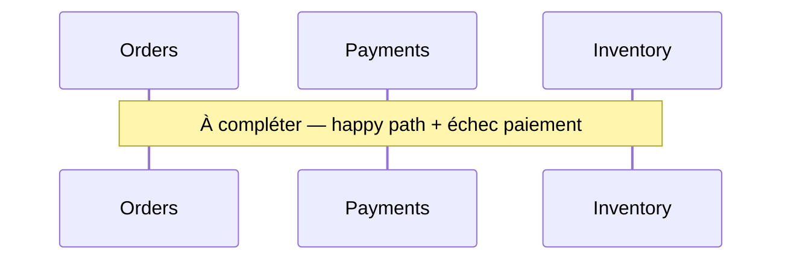
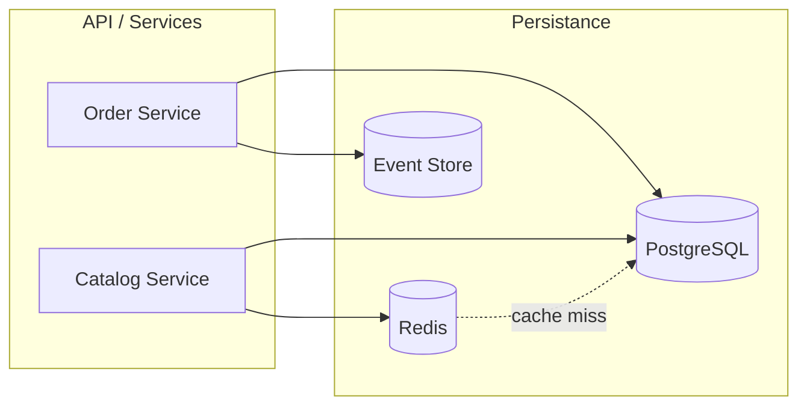

# Ateliers — Module 3 Data & persistance

Durée estimée : **8 à 10 heures** (semaine 3 du [planning](../../docs/planning.md)).

---

## Exercice 1 — Choix SQL vs NoSQL (45 min)

Pour chaque cas, choisissez la famille de stockage principale et justifiez en 2–3 phrases.

| Cas | Votre choix | Justification |
| --- | ----------- | ------------- |
| Système de réservation de vols (sièges limités, paiement) | | |
| Fil d'actualité personnalisé (millions d'utilisateurs) | | |
| Catalogue produits avec attributs variables par catégorie | | |
| Compteur de vues en temps réel | | |
| Graphe de relations « amis d'amis » | | |
| Reporting financier trimestriel | | |

<details>
<summary>Corrigé indicatif</summary>

| Cas | Choix |
| --- | ----- |
| Vols / réservation | SQL (ACID, contraintes sièges) |
| Fil d'actualité | SQL + cache Redis ; ou Cassandra si scale extrême |
| Catalogue flexible | Document DB (MongoDB) ou SQL JSON (PostgreSQL) |
| Compteur vues | Redis `INCR` + flush périodique SQL |
| Amis d'amis | Graphe (Neo4j) |
| Reporting | OLAP / entrepôt (Synapse, Snowflake) |

</details>

---

## Exercice 2 — OLTP vs OLAP (30 min)

Une startup e-commerce veut :

1. Traiter 500 commandes/minute
2. Afficher un dashboard « ventes par catégorie sur 12 mois » mis à jour chaque nuit

### Questions

1. Quelle base pour (1) ? Quelle solution pour (2) ?
2. Comment alimenter le dashboard sans impacter les commandes ?
3. Dessinez un schéma ASCII ou Mermaid du flux de données.

<details>
<summary>Piste de réponse</summary>

1. OLTP : PostgreSQL / Azure SQL. OLAP : Synapse ou PostgreSQL réplica + tables agrégées.
2. ETL nocturne, CDC (Debezium), ou événements `OrderCompleted` → projection analytics.
3. `OLTP → (ETL/Events) → Data Warehouse → BI Tool`

</details>

---

## Exercice 3 — Concurrence (45 min)

### Scénario

Deux utilisateurs achètent le **dernier exemplaire** d'un produit en même temps.

1. Décrivez le scénario « lost update » sans protection.
2. Proposez une solution **optimiste** (champs, requête SQL ou logique applicative).
3. Proposez une solution **pessimiste**.
4. Quelle approche recommandez-vous pour un site e-commerce classique ?

**Bonus :** rédigez le pseudo-code du handler qui retourne `409 Conflict` en cas d'échec optimiste.

---

## Exercice 4 — Saga chorégraphiée (1 h)

### Contexte

Commande e-commerce implique 3 services :

- **Orders** — crée la commande
- **Payments** — débite le client
- **Inventory** — réserve le stock

### Travail

1. Listez les événements échangés (nom + payload minimal).
2. Décrivez le flux nominal (happy path).
3. Le paiement échoue après réservation stock : quelles **compensations** ?
4. Dessinez un diagramme de séquence Mermaid.



<details>
<summary>Événements indicatifs</summary>

- `OrderCreated` → déclenche paiement et réservation
- `PaymentCompleted` / `PaymentFailed`
- `StockReserved` / `StockReservationFailed`
- `OrderConfirmed` / `OrderCancelled`
- Compensations : `ReleaseStock`, `RefundPayment` (si débit partiel)

</details>

---

## Exercice 5 — Cache et invalidation (45 min)

### Contexte

API produit : 10 000 req/s en lecture, 10 req/s en écriture. PostgreSQL commence à saturer.

1. Quel pattern de cache recommandez-vous ?
2. Quelle TTL pour les fiches produit ?
3. Un admin modifie le prix : comment garantir que les utilisateurs ne voient pas l'ancien prix plus de X secondes ?
4. Listez les clés Redis que vous utiliseriez.

<details>
<summary>Piste</summary>

- Cache-aside, TTL 5–15 min
- Invalidation explicite sur `UpdateProduct` + TTL court comme filet
- Clés : `product:{id}`, `product:list:category:{catId}:page:{n}`
- Option : pub/sub Redis pour invalider toutes les instances API

</details>

---

## Atelier principal — Architecture multi-bases (3–4 h)

**Livrable obligatoire du module.**

### Énoncé

Concevez l'architecture data d'une **plateforme de commande B2B** :

| Contrainte | Valeur |
| ---------- | ------ |
| Utilisateurs | 2 000 entreprises clientes |
| Commandes | 50 000 / jour, pic 200 / minute |
| Catalogue | 100 000 SKU, lecture intensive |
| Règle métier | Commande = réservation stock + facturation différée |
| Audit | Historique complet des changements de statut commande |
| Latence catalogue | p95 < 50 ms |

### Stockages imposés (à intégrer dans le design)

1. **PostgreSQL** — données transactionnelles
2. **Redis** — cache
3. **Event store** (EventStoreDB, Kafka ou table append-only) — journal d'événements

### Livrable : `data-architecture.md`

Utilisez le gabarit :

```markdown
# Architecture Data — Plateforme B2B

## 1. Vue d'ensemble
[Diagramme : services, bases, flux]

## 2. Répartition des données

| Donnée | Stockage | Justification |
| ------ | -------- | ------------- |
| Commandes | PostgreSQL | |
| Lignes de commande | PostgreSQL | |
| Catalogue SKU | ? | |
| Sessions / panier | ? | |
| Historique statuts | Event store | |
| ... | | |

## 3. Schéma relationnel (simplifié)
[Tables principales, clés, index importants]

## 4. Stratégie de cache
| Ressource | Clé Redis | TTL | Invalidation |
| --------- | --------- | --- | ------------ |

## 5. Flux événementiels
| Événement | Producteur | Consommateurs | Payload clé |
| --------- | ---------- | ------------- | ----------- |

## 6. Saga ou orchestration
[Flux commande : étapes, compensations]

## 7. Concurrence
[Stock, commandes : optimiste / pessimiste]

## 8. Choix technologiques — synthèse

| Composant | Techno | Alternative écartée | Pourquoi |
| --------- | ------ | ------------------- | -------- |

## 9. Risques et mitigations
| Risque | Impact | Mitigation |
| ------ | ------ | ---------- |

## 10. Estimation stockage (ordre de grandeur)
[Commandes/an, taille events, taille cache]
```

### Diagramme attendu

Produisez un diagramme (Mermaid accepté) montrant les trois stockages :



Adaptez et enrichissez selon votre design (outbox, workers, projections).

---

## Exercice 6 — Estimation stockage (30 min)

À partir de l'atelier principal :

- 50 000 commandes / jour, 5 lignes moyennes / commande
- Commande + lignes ≈ 2 Ko
- 5 événements / commande dans l'event store ≈ 500 octets chacun
- Cache : 10 000 SKU les plus consultés × 5 Ko

Calculez le volume sur **1 an** pour PostgreSQL, event store et Redis.

---

## Exercice 7 — Design review (30 min)

| Question | ✓ / ✗ | Commentaire |
| -------- | ----- | ----------- |
| Chaque donnée a un stockage primaire clair ? | | |
| Le cache est-il invalidé à l'écriture ? | | |
| La saga a-t-elle des compensations définies ? | | |
| OLTP séparé de l'analytics ? | | |
| Event store : audit ou aussi source de vérité ? | | |
| Pas de JOIN cross-microservice implicite ? | | |

---

## Livrables à rendre

| Fichier | Exercice | Obligatoire |
| ------- | -------- | ----------- |
| `data-architecture.md` | Atelier principal | Oui |
| Diagramme data (.drawio, .png ou Mermaid) | Atelier principal | Oui |
| `saga-sequence.md` ou diagramme | 4 | Recommandé |
| Réponses exercices 1–3 | 1–3 | Recommandé |

---

## Critères d'évaluation

| Critère | Attendu |
| ------- | ------- |
| Justification | Chaque techno liée à un besoin NFR ou fonctionnel |
| Cohérence | SQL, Redis et event store ont des rôles distincts |
| Saga / concurrence | Traités explicitement |
| Pragmatisme | Pas de sur-architecture pour 50k commandes/jour |
| Chiffres | Au moins une estimation de stockage |

---

## Suite

Module suivant : [04 — Scalabilité & performance](../04-scalability/README.md)
