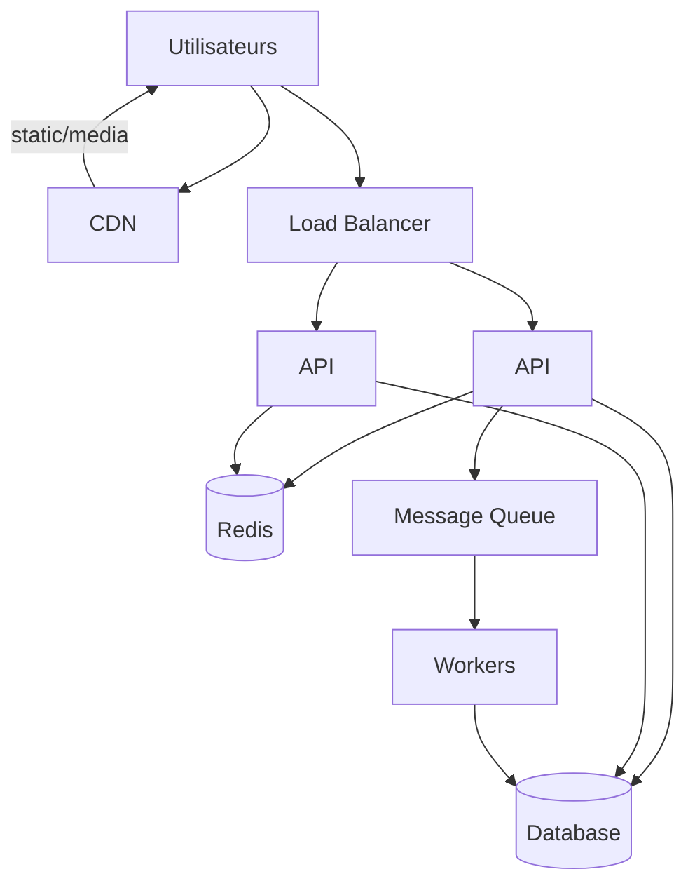

# Exercices — Module 4 Scalabilité & performance

Durée estimée : **8 à 10 heures** (semaine 4 du [planning](../../docs/planning.md)).

---

## Exercice 1 — Estimation de charge (45 min)

### Énoncé

Plateforme de **vidéo à la demande** (type Netflix simplifié) :

| Métrique | Valeur |
| -------- | ------ |
| Abonnés | 10 millions |
| Actifs simultanés (pic) | 500 000 |
| Chaque actif | 1 flux vidéo 5 Mbps + 2 req API/min (recommandations, heartbeat) |
| Catalogue | 50 000 titres, metadata 10 Ko/titre |

### À calculer

1. Bande passante totale sortante au pic (Gbps)
2. Requêtes API par seconde au pic
3. Taille du catalogue en mémoire si tout est en cache Redis
4. Le CDN est-il obligatoire pour la vidéo ? Pourquoi ?

<details>
<summary>Solution indicative</summary>

```text
Bande passante = 500 000 × 5 Mbps = 2,5 Pbps... 
  → 500 000 × 5 Mbit/s = 2 500 000 Mbit/s = 2,5 Tbit/s ≈ 312 Go/s (ordre de grandeur énorme)
  → CDN indispensable pour vidéo

API req/s = 500 000 × (2/60) ≈ 16 700 req/s

Catalogue Redis = 50 000 × 10 Ko = 500 Mo (tenable)
```

</details>

---

## Exercice 2 — Identifier le goulot (30 min)

Architecture actuelle :

```text
1 × API (4 vCPU) — max 800 req/s mesuré
1 × PostgreSQL — max 2 000 lectures/s simples
Pas de cache
Trafic actuel : 1 500 req/s (90 % lecture catalogue)
```

1. Où est le goulot ?
2. Proposez **deux** solutions par ordre de priorité (coût / impact).
3. Quel cache hit ratio minimum pour que la DB tienne ?

<details>
<summary>Piste</summary>

- Goulot : API (800 < 1 500) et bientôt DB (1 500 × 0,9 = 1 350 lectures, proche limite)
- Priorité 1 : cache Redis sur catalogue (viser 90 % hit → 150 req/s DB)
- Priorité 2 : scale API à 3 instances derrière LB
- Hit ratio min : 1 - (2000/1350) n'a pas de sens si API est le premier blocage ; corriger API d'abord, puis hit > ~85 % pour marge DB

</details>

---

## Exercice 3 — Choix de sharding (45 min)

Une table `events` atteint **2 milliards** de lignes. Requêtes :

- 95 % : `WHERE user_id = ? AND created_at > ?` (historique utilisateur)
- 5 % : agrégations globales analytics (tolèrent 1 h de retard)

1. Proposez une **clé de shard**.
2. Comment traiter les 5 % analytics sans scanner tous les shards ?
3. Quel risque si vous shardiez par `created_at` (range) ?

<details>
<summary>Piste</summary>

- Shard key : `user_id` (hash) — requêtes utilisateur localisées
- Analytics : pipeline CDC / stream → entrepôt (Synapse) ou index global
- Shard par date : hot spot sur shard « aujourd'hui », déséquilibre

</details>

---

## Exercice 4 — Sync vs async (30 min)

Pour chaque opération, choisissez **synchrone** ou **asynchrone** (file/stream) :

| Opération | Sync / Async | Justification |
| --------- | ------------ | ------------- |
| Paiement carte bancaire | | |
| Envoi email confirmation | | |
| Génération miniature vidéo | | |
| Mise à jour stock après commande | | |
| Indexation recherche produit | | |
| Notification push mobile | | |

---

## Atelier principal — Design système scalable (3–4 h)

**Livrables obligatoires du module.**

Choisissez **un** scénario :

- **A — E-commerce** (type Amazon light)
- **B — Streaming vidéo** (type Netflix light)
- **C — Réseau social** (fil d'actualité, type Twitter light)

### Contraintes communes

| NFR | Cible |
| --- | ----- |
| Utilisateurs enregistrés | 5 millions |
| Utilisateurs actifs / jour | 500 000 |
| Pic utilisateurs simultanés | 50 000 |
| Disponibilité | 99,9 % |
| Latence API (hors vidéo) | p95 < 200 ms |

### Spécificités par scénario

**A — E-commerce :**

- 20 000 commandes / jour, pic 50 / minute
- Catalogue 200 000 SKU, lecture intensive
- Panier et checkout critiques

**B — Streaming :**

- 80 % du trafic = vidéo
- Débit moyen 4 Mbps / flux
- Recommandations personnalisées

**C — Réseau social :**

- 10 millions de posts / jour
- Fil d'actualité personnalisé, fan-out on write vs read
- Timeline lecture : p95 < 300 ms

### Livrable 1 : `scalable-architecture.md`

```markdown
# Architecture scalable — [Scénario choisi]

## 1. Exigences
[Fonctionnel + NFR + hypothèses]

## 2. Estimation de charge
| Métrique | Calcul | Résultat |
| -------- | ------ | -------- |
| Req API / s (pic) | | |
| Bande passante | | |
| Écritures / s | | |
| Stockage / an | | |

## 3. High-level design
[Diagramme + description des composants]

## 4. Load balancing
[Couche, algorithme, health checks, SSL]

## 5. Cache
| Donnée | Niveau (local/Redis/CDN) | TTL | Hit ratio cible |
| ------ | ------------------------ | --- | --------------- |

## 6. Base de données
[Primary, replicas, sharding si nécessaire]

## 7. Traitement async
| Tâche | Queue / Stream | Consumers |
| ----- | -------------- | --------- |

## 8. Points de défaillance
| SPOF | Mitigation |
| ---- | ---------- |

## 9. Trade-offs
[3 décisions majeures argumentées]
```

### Livrable 2 : `capacity-plan.md`

Plan de montée en charge en **3 phases** :

```markdown
# Plan de montée en charge

## Phase 1 — MVP (0 – 50k DAU)
| Composant | Dimensionnement | Coût relatif |
| --------- | --------------- | ------------ |

## Phase 2 — Croissance (50k – 500k DAU)
| Composant | Changement | Déclencheur (seuil) |
| --------- | ---------- | ------------------- |

## Phase 3 — Scale (500k+ DAU)
| Composant | Changement | Déclencheur |
| --------- | ---------- | ----------- |

## Métriques d'alerte
| Métrique | Warning | Critical | Action |
| -------- | ------- | -------- | ------ |

## Load test plan
[Outils, scénarios, critères de succès]
```

### Diagramme attendu



Adaptez selon votre scénario (shards, read replicas, Kafka, etc.).

---

## Exercice 5 — Fan-out Twitter (1 h) — scénario C uniquement

Si vous avez choisi le réseau social :

| Approche | Description |
| -------- | ----------- |
| **Fan-out on write** | À la publication, pousser le post dans le cache de chaque abonné |
| **Fan-out on read** | À la lecture, agréger les posts des abonnés |

Utilisateur avec **1 million** d'abonnés publie un post.

1. Comparez les deux approches (latence write, read, stockage).
2. Quelle approche hybride proposez-vous (ex. : fan-out write pour utilisateurs normaux, read pour célébrités) ?
3. Estimez le stockage Redis si fan-out on write pour 1M abonnés × 500 octets par référence de post.

---

## Exercice 6 — Cache hit ratio (30 min)

API catalogue : **8 000 req/s** au pic. PostgreSQL tient **1 200 req/s** lectures.

1. Quel hit ratio cache minimum est requis ?
2. Si Redis ajoute 1 ms et PostgreSQL 15 ms, quelle latence moyenne avec 90 % hit ratio ?
3. Que se passe-t-il si le cache tombe (fail-open vs fail-closed) ?

<details>
<summary>Calculs</summary>

```text
Miss rate max = 1200 / 8000 = 15 % → hit ratio min = 85 %

Latence moyenne = 0,9 × 1 ms + 0,1 × 15 ms = 2,4 ms

Fail-open : charge DB → risque cascade
Fail-closed : erreurs 503 → dégradation contrôlée
```

</details>

---

## Exercice 7 — Design review (30 min)

| Question | ✓ / ✗ |
| -------- | ----- |
| Estimation chiffrée présente ? | |
| Stateless API ? | |
| Cache avec TTL et invalidation ? | |
| Async pour tâches lentes ? | |
| SPOF identifiés et mitigés ? | |
| Plan de scale en phases ? | |
| Pas de sur-engineering pour la phase 1 ? | |

---

## Livrables à rendre

| Fichier | Obligatoire |
| ------- | ----------- |
| `scalable-architecture.md` | Oui |
| `capacity-plan.md` | Oui |
| Diagramme architecture | Oui |
| Réponses exercices 1–4 | Recommandé |

---

## Critères d'évaluation

| Critère | Attendu |
| ------- | ------- |
| Chiffres | req/s, bande passante ou stockage estimés |
| Cache | Hit ratio cible, niveaux CDN/Redis |
| Async | Tâches lentes découplées |
| Phases | MVP réaliste, seuils de passage documentés |
| Trade-offs | Fan-out, sharding, sync/async justifiés |

---

## Suite

Module suivant : [05 — Cloud Azure](../05-cloud-azure/README.md)
