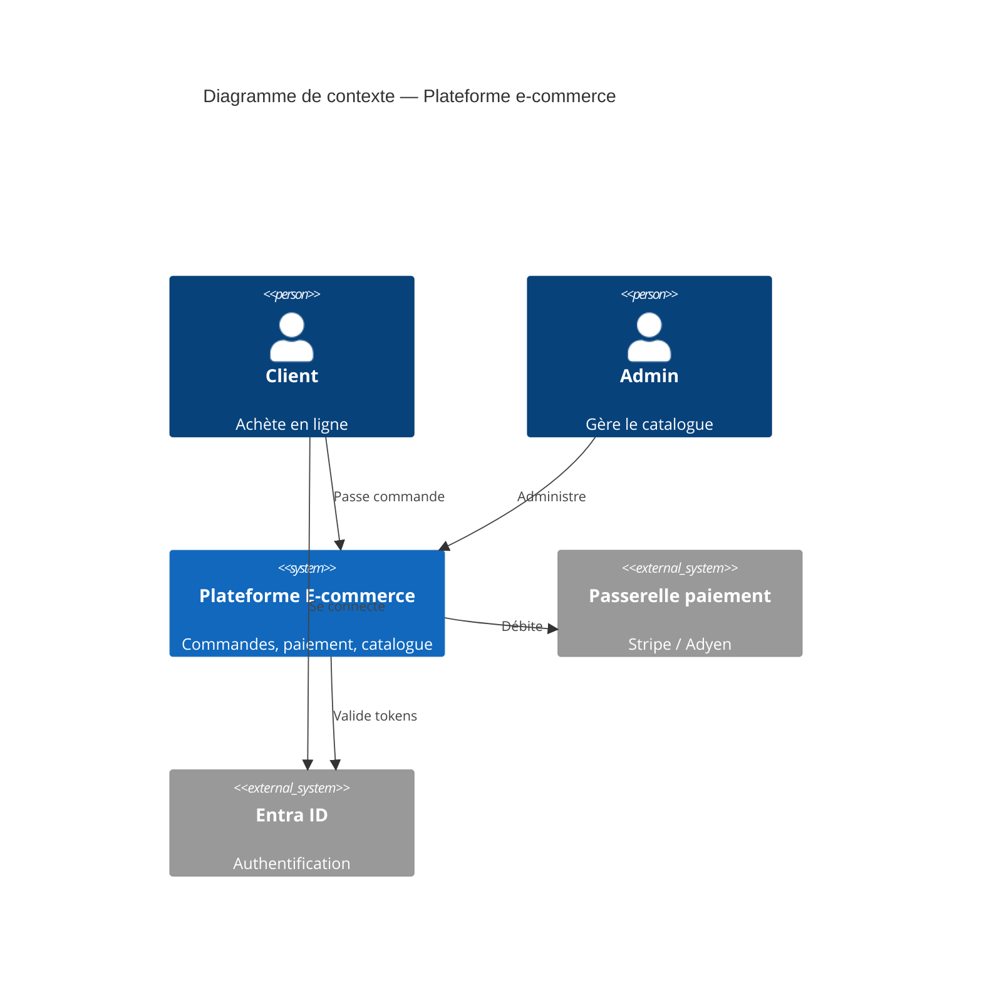
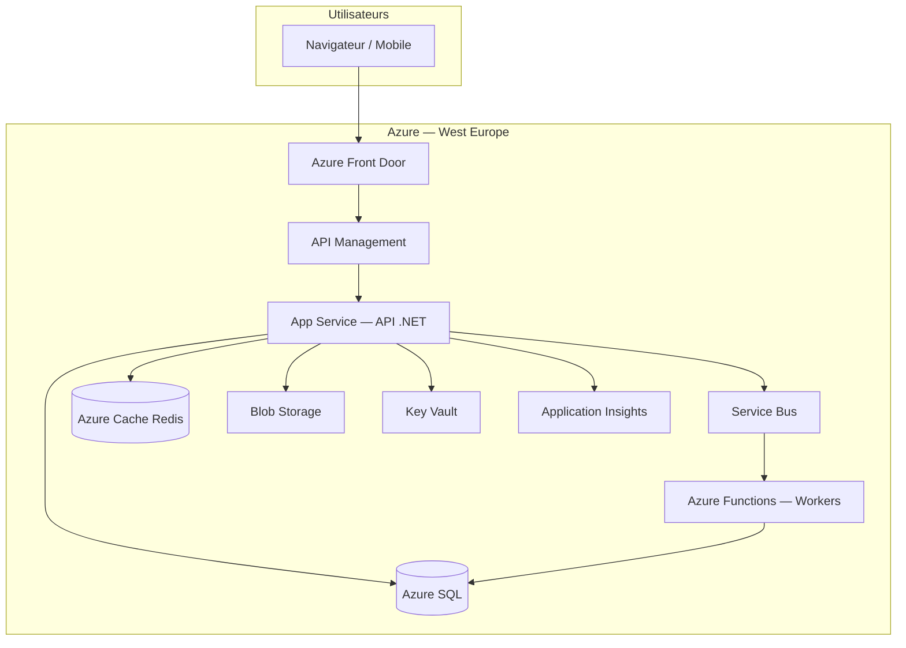

# Architecture cloud Azure — Patterns et atelier

Ce document présente les patterns d'architecture Azure, le cadre Well-Architected, la reprise d'activité et l'atelier de conception avec livrables C4, chiffrage et PRA/PCA.

---

## 1. Well-Architected Framework

Microsoft définit **5 piliers** pour évaluer une architecture cloud :

| Pilier | Question centrale |
| ------ | ----------------- |
| **Fiabilité** | Le système résiste aux pannes et se rétablit ? |
| **Sécurité** | Données et workloads protégés ? |
| **Optimisation des coûts** | Dépenses alignées sur la valeur ? |
| **Excellence opérationnelle** | Déploiement et ops automatisés, observables ? |
| **Performance** | Scale et latence adaptés à la charge ? |

Chaque décision d'architecture devrait être justifiée par au moins un pilier (souvent avec trade-offs entre piliers).

---

## 2. Patterns Azure courants

### N-tier (3-tiers)

```text
[Front Door] → [App Service] → [Azure SQL]
                    ↓
              [Redis Cache]
```

**Usage :** applications classiques, MVP cloud.

### Microservices sur AKS

```text
[APIM] → [AKS : svc-orders, svc-payments, ...]
              ↓           ↓
         [SQL orders]  [SQL payments]
              ↓
         [Service Bus]
```

**Usage :** domaines découplés, équipes autonomes.

### Event-driven

```text
[App] → [Service Bus Topic] → [Functions workers]
         [Event Grid]    → [Logic Apps]
```

**Usage :** sagas, notifications, intégrations.

### CQRS sur Azure

```text
Commands → App Service → SQL Primary
Queries  → App Service → Redis / read replica / Cosmos projection
Events   → Event Hubs → Stream Analytics / Synapse
```

### Static + API

```text
SPA (Blob Static Website ou App Service) 
  → APIM → API (App Service)
  → CDN / Front Door pour assets
```

### Throttling et protection

```text
Internet → Front Door (WAF) → APIM (rate limit) → Backend
```

---

## 3. Réseau et sécurité (baseline)

### Architecture réseau type

```diagram
┌─────────────────────────────────────────────────┐
│ Virtual Network (10.0.0.0/16)                   │
│  ┌─────────────────┐  ┌─────────────────────┐  │
│  │ Subnet App      │  │ Subnet Data         │  │
│  │ (App Service    │  │ (Private Endpoint   │  │
│  │  VNet integration)│ │  → SQL, Redis)      │  │
│  └─────────────────┘  └─────────────────────┘  │
└─────────────────────────────────────────────────┘
```

### Principes

- **Private Endpoints** pour SQL, Storage, Key Vault (pas d'exposition publique)
- **NSG** sur les subnets pour filtrer le trafic
- **Managed Identity** plutôt que chaînes de connexion en config
- **Key Vault** pour secrets et rotation
- **HTTPS only** partout

---

## 4. Multi-région et haute disponibilité

### Niveaux de disponibilité

| Niveau | Architecture | RTO typique |
| ------ | ------------ | ----------- |
| Single region, single zone | 1 App Service, 1 SQL | Heures |
| Single region, multi-zone | ZRS storage, zone-redundant SQL | Minutes |
| Multi-région actif-passif | Primary EU + standby US | Minutes–heures |
| Multi-région actif-actif | Front Door route vers les deux | Secondes |

### Pattern actif-passif

```diagram
                    ┌─────────────────┐
                    │ Azure Front Door │
                    │ (health probe)   │
                    └────────┬────────┘
              ┌──────────────┴──────────────┐
              ▼ (primary)                   ▼ (secondary, standby)
        West Europe                    North Europe
        App Service + SQL              App Service + SQL (réplica)
              │                              ▲
              └──────── réplication geo ─────┘
```

**Failover :** manuel ou automatisé (Traffic Manager / Front Door priority).

### Pattern actif-actif

Les deux régions servent du trafic. Nécessite :

- Données multi-région (Cosmos multi-write, ou réplication async + conflits gérés)
- Sessions stateless ou sticky global
- Coût double

---

## 5. PRA et PCA

### Définitions

| Terme | Signification |
| ----- | ------------- |
| **PRA** (Plan de Reprise d'Activité) | Comment **reprendre** après sinistre |
| **PCA** (Plan de Continuité d'Activité) | Comment **maintenir** l'activité pendant la crise |
| **RTO** | Recovery Time Objective — délai max de rétablissement |
| **RPO** | Recovery Point Objective — perte de données max acceptable |

```text
Sinistre ──► [RPO] données perdues max ──► [RTO] service rétabli
```

### Exemples par criticité

| Système | RPO | RTO | Stratégie |
| ------- | --- | --- | --------- |
| Site marketing | 24 h | 4 h | Backup Blob, restore manuel |
| API e-commerce | 15 min | 1 h | Geo-replica SQL, failover Front Door |
| Paiement | 0 | 15 min | Multi-AZ, sync replica, runbook automatisé |

### Composants du plan PRA/PCA

```markdown
## 1. Scénarios de sinistre
- Panne région Azure
- Corruption base de données
- Ransomware / compromission
- Erreur de déploiement

## 2. Classification des workloads
| Workload | Criticité | RTO | RPO |

## 3. Procédures de failover
- Déclencheurs (qui décide ?)
- Étapes techniques (ordre)
- Rollback

## 4. Tests
- Game day trimestriel
- Backup restore test mensuel

## 5. Communication
- Contacts, escalation, status page
```

### Services Azure pour DR

| Besoin | Service |
| ------ | ------- |
| Backup SQL | Automated backups + LTR (Long Term Retention) |
| Failover SQL | Failover groups (geo-replication) |
| Backup fichiers | Blob versioning + GRS |
| Runbook failover | Azure Site Recovery, Automation |
| DNS failover | Front Door, Traffic Manager |

---

## 6. Diagrammes C4 sur Azure

### Niveau Context

Acteurs et système dans son environnement (sans détail technique).



### Niveau Container

Conteneurs logiques mappés aux services Azure.



### Tableau de mapping (obligatoire dans le livrable)

| Composant logique | Service Azure | SKU indicatif | Justification |
| ----------------- | ------------- | ------------- | ------------- |
| API REST | App Service P1v3 | 2 instances | .NET, auto-scale |
| Cache catalogue | Redis Standard C1 | 1 shard | 85 % hit ratio |
| Base commandes | Azure SQL S3 | 100 DTU | ACID, geo-replica |
| Files async | Service Bus Standard | 1 namespace | Saga commandes |
| Médias produits | Blob Hot + CDN | GRS | Images catalogue |
| Secrets | Key Vault Standard | — | Connection strings |
| Gateway | APIM Standard | 1 unit | Rate limit partenaires |

---

## 7. Chiffrage Azure

### Méthode

1. Lister chaque ressource avec SKU et quantité
2. Saisir dans le [Pricing Calculator](https://azure.microsoft.com/pricing/calculator/)
3. Ajouter transfert sortant (estimer Go/mois)
4. Documenter hypothèses

### Gabarit `azure-cost-estimate.md`

```markdown
# Estimation coûts Azure — [Projet]

**Région :** West Europe  
**Période :** mensuel  
**Date :** YYYY-MM-DD

## Hypothèses de charge
- DAU : ...
- Req/s pic : ...
- Stockage : ... Go

## Détail par ressource

| Ressource | SKU | Qté | Coût unitaire | Coût mensuel |
| --------- | --- | --- | ------------- | ------------ |
| App Service P1v3 | | 2 | | |
| Azure SQL | | 1 | | |
| Redis C1 | | 1 | | |
| Service Bus | | 1 | | |
| Blob Storage | | ... Go | | |
| APIM | | 1 unit | | |
| Front Door | | | | |
| App Insights | | ... Go logs | | |
| **Total** | | | | **€ ...** |

## Optimisations possibles
- Reserved instances (1 an / 3 ans) : -30 à 40 %
- Arrêt environnements dev la nuit
- Tier Cool pour blobs peu consultés

## Marge recommandée
+30 % pour pics et croissance → **€ .../mois budget**
```

### Ordres de grandeur (indicatifs, EU, 2024–2025)

| Configuration MVP | Fourchette mensuelle |
| ----------------- | -------------------- |
| 1 App Service B2 + SQL Basic + Blob | 50–150 € |
| Prod légère (2× P1v3, SQL S3, Redis) | 400–800 € |
| Prod + APIM Standard + Front Door | +300–600 € |
| AKS petit cluster (3 nodes) | 300–600 € hors workloads |

*Vérifier toujours avec le calculateur — les prix évoluent.*

---

## 8. Atelier — Architecture cloud complète (4–5 h)

**Livrables obligatoires du module.**

### Énoncé

Concevez l'architecture Azure d'une **plateforme SaaS B2B de gestion de factures** :

| Exigence | Détail |
| -------- | ------ |
| Tenants | 500 entreprises clientes (multi-tenant) |
| Utilisateurs | 10 000 au total |
| Fonctionnel | Création factures, envoi PDF email, tableau de bord |
| Intégrations | API partenaires (webhooks sortants) |
| Conformité | Données en UE, chiffrement au repos |
| NFR | 99,9 % dispo, p95 API < 300 ms, RPO 1 h, RTO 4 h |

### Travail demandé

1. **Diagramme C4 Context**
2. **Diagramme C4 Container** avec services Azure nommés
3. **Tableau de mapping** composant → service Azure
4. **Chiffrage** mensuel (`azure-cost-estimate.md`)
5. **Plan PRA/PCA** (`dr-plan.md`) avec RTO/RPO
6. **3 ADR** (Architecture Decision Records) :

```markdown
### ADR-001 : App Service vs AKS
- Statut : accepté
- Contexte : ...
- Décision : App Service
- Conséquences : ...

### ADR-002 : Modèle multi-tenant (DB)
- Options : DB par tenant / schéma par tenant / colonne tenant_id
- Décision : ...
- Conséquences : ...

### ADR-003 : Messaging
- Décision : Service Bus vs Event Grid
- ...
```

### Multi-tenant — options data

| Modèle | Isolation | Coût | Complexité |
| ------ | --------- | ---- | ---------- |
| DB par tenant | ★★★★★ | Élevé | Ops lourde |
| Schéma par tenant | ★★★★ | Moyen | Migrations × N |
| Colonne `tenant_id` | ★★★ | Faible | Risque fuite si bug requête |
| Elastic pool SQL | ★★★ | Moyen | Bon compromis PaaS |

Pour 500 tenants B2B : souvent **colonne tenant_id + row-level security** ou **elastic pool**.

---

## 9. Exercices complémentaires

### Exercice A — Mapping (30 min)

Associez chaque besoin au service Azure principal :

| Besoin | Service |
| ------ | ------- |
| Héberger une API .NET 8 | |
| Traiter un upload blob → générer miniature | |
| Notifier un webhook client après facture | |
| Limiter à 1000 req/min par clé API | |
| Stocker certificat TLS | |
| Auth SSO entreprise (SAML/OIDC) | |

<details>
<summary>Corrigé</summary>

App Service (ou Functions), Functions + Blob trigger, Service Bus + Function ou Logic Apps, APIM, Key Vault, Entra ID

</details>

### Exercice B — DR (30 min)

SQL Primary en **France Central**, RPO 15 min, RTO 1 h.

1. Quel service Azure pour la réplication ?
2. Où placer le secondary ?
3. Quel composant route le trafic après failover ?

### Exercice C — FinOps (20 min)

Liste 5 actions pour réduire la facture Azure sans dégrader la prod.

---

## 10. Checklist revue architecture Azure

| ✓ | Critère |
| - | ------- |
| ☐ | Chaque composant a un service Azure nommé |
| ☐ | Pas de secrets en clair (Key Vault + Managed Identity) |
| ☐ | Réseau : Private Endpoints pour data plane |
| ☐ | Monitoring (App Insights) prévu |
| ☐ | Backup et rétention définis |
| ☐ | RTO/RPO documentés et réalistes |
| ☐ | Coûts estimés avec hypothèses |
| ☐ | Tags et budgets configurés |
| ☐ | Environnements dev/staging/prod séparés |
| ☐ | Conformité région (UE) vérifiée |

---

## Livrables à rendre

| Fichier | Obligatoire |
| ------- | ----------- |
| C4 Context (fichier ou Mermaid) | Oui |
| C4 Container avec services Azure | Oui |
| `azure-cost-estimate.md` | Oui |
| `dr-plan.md` | Oui |
| 3 ADR | Recommandé |

Copie possible dans [`project/`](../../project/) pour le projet final.

---

## Suite

Module suivant : [06 — Résilience & observabilité](../06-resilience/README.md)
