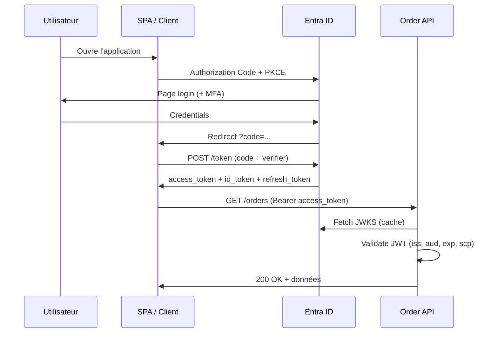

# Authentification et autorisation

Ce document couvre OAuth 2.0, OpenID Connect (OIDC), les tokens JWT et l'intégration avec **Microsoft Entra ID** dans une architecture .NET / Azure.

---

## 1. Concepts de base

| Terme | Définition |
| ----- | ---------- |
| **Authentification (AuthN)** | Qui êtes-vous ? |
| **Autorisation (AuthZ)** | Que pouvez-vous faire ? |
| **Identité** | Représentation d'un utilisateur, service ou appareil |
| **Claims** | Attributs sur l'identité (email, rôle, tenant) |
| **Token** | Preuve d'authentification / autorisation transmissible |

```text
Authentification → Token → Autorisation (vérification claims / permissions)
```

---

## 2. OAuth 2.0

Framework d'**autorisation déléguée** : une application accède à des ressources **au nom d'un utilisateur** sans connaître son mot de passe.

### Rôles

| Rôle | Description | Exemple |
| ---- | ----------- | ------- |
| **Resource Owner** | Utilisateur | Employé |
| **Client** | Application demandeuse | App mobile, SPA |
| **Authorization Server** | Émet les tokens | Entra ID |
| **Resource Server** | API protégée | Order API |

### Types de tokens

| Token | Usage | Format |
| ----- | ----- | ------ |
| **Access token** | Accéder à une API | JWT ou opaque |
| **Refresh token** | Obtenir un nouvel access token | Opaque |
| **ID token** | Identité utilisateur (OIDC) | JWT |

### Flux OAuth 2.0 courants

#### Authorization Code + PKCE (recommandé)

Flux standard pour **SPA** et **applications mobiles**.

```text
1. Client redirige vers Entra ID (login)
2. Utilisateur s'authentifie
3. Entra ID redirige avec ?code=...
4. Client échange code + code_verifier contre tokens (backend ou PKCE public)
5. Client appelle API avec Authorization: Bearer <access_token>
```

**PKCE** (Proof Key for Code Exchange) : protège contre l'interception du code sur mobile/SPA.

#### Client Credentials

Pour **communication machine-to-machine** (pas d'utilisateur).

```text
Service A → Entra ID (client_id + secret ou certificat)
         ← access_token (scope api://orders/.default)
Service A → Order API avec Bearer token
```

#### On-Behalf-Of (OBO)

Chaîne de délégation : API reçoit un token utilisateur et en obtient un autre pour appeler une API aval.

```text
SPA → API Gateway → Order API → Payment API
         (token user)  (token OBO)
```

### Scopes et permissions

```text
scope: api://order-api/orders.read
scope: api://order-api/orders.write
```

- **Delegated permissions** : au nom de l'utilisateur
- **Application permissions** : au nom de l'application (admin consent)

---

## 3. OpenID Connect (OIDC)

Couche d'**identité** au-dessus d'OAuth 2.0. Ajoute l'**ID token** (JWT contenant claims utilisateur).

### Endpoints Entra ID (well-known)

```test
https://login.microsoftonline.com/{tenant}/v2.0/.well-known/openid-configuration
```

Fournit : `authorization_endpoint`, `token_endpoint`, `jwks_uri`, etc.

### Claims courants dans un ID token

```json
{
  "iss": "https://login.microsoftonline.com/{tenant}/v2.0",
  "sub": "AAAAAAAAAAAAAAAAAAAAAIkzqFVrSaSaFHy782bbtaQ",
  "aud": "client-id",
  "exp": 1710000000,
  "iat": 1709996400,
  "name": "Jean Dupont",
  "preferred_username": "jean@company.com",
  "oid": "object-id-entra",
  "tid": "tenant-id"
}
```

### Access token JWT (API)

```json
{
  "aud": "api://order-api",
  "scp": "orders.read orders.write",
  "roles": ["OrderManager"],
  "tid": "tenant-id",
  "oid": "user-object-id"
}
```

---

## 4. Microsoft Entra ID

### Scénarios

| Scénario | Service Entra |
| -------- | ------------- |
| Employés entreprise | Entra ID (workforce) |
| Clients externes (B2C) | Microsoft Entra External ID |
| Partenaires B2B | Entra B2B (invitation guests) |
| Apps multi-tenant SaaS | Multi-tenant app registration |

### App Registration

Chaque application (client ou API) s'enregistre dans Entra :

| Élément | Description |
| ------- | ----------- |
| **Application (client) ID** | Identifiant public |
| **Directory (tenant) ID** | Annuaire Entra |
| **Client secret / certificat** | Auth confidentielle |
| **Redirect URIs** | URLs de callback OAuth |
| **API permissions** | Scopes exposés / consommés |
| **App roles** | Rôles RBAC assignables |

### Exposer une API

```test
Application ID URI : api://order-api
Scopes :
  - orders.read
  - orders.write
App roles :
  - OrderManager
  - OrderViewer
```

---

## 5. JWT — validation côté API

L'API **ne fait pas confiance** au client : elle valide chaque token.

### Vérifications

| Check | Détail |
| ----- | ------ |
| **Signature** | Clés publiques JWKS Entra |
| **Issuer** (`iss`) | Tenant attendu |
| **Audience** (`aud`) | ID de cette API |
| **Expiration** (`exp`) | Token non expiré |
| **Scopes / rôles** | Autorisation fine |

### ASP.NET Core

```csharp
builder.Services.AddAuthentication(JwtBearerDefaults.AuthenticationScheme)
    .AddMicrosoftIdentityWebApi(builder.Configuration.GetSection("AzureAd"));

builder.Services.AddAuthorization(options =>
{
    options.AddPolicy("OrdersWrite", policy =>
        policy.RequireClaim("scp", "orders.write")
              .RequireRole("OrderManager"));
});

app.UseAuthentication();
app.UseAuthorization();

[Authorize(Policy = "OrdersWrite")]
[HttpPost]
public async Task<IActionResult> CreateOrder(...) { ... }
```

`appsettings.json` :

```json
{
  "AzureAd": {
    "Instance": "https://login.microsoftonline.com/",
    "TenantId": "your-tenant-id",
    "ClientId": "api-client-id",
    "Audience": "api://order-api"
  }
}
```

---

## 6. Modèles d'autorisation

### RBAC (Role-Based Access Control)

```text
Utilisateur → Rôle (OrderManager) → Permissions (orders.write)
```

**Entra ID App Roles** : rôles assignés aux utilisateurs/groupes.

### ABAC (Attribute-Based)

Décision basée sur attributs : `department == "Sales" AND region == "EU"`.

Implémenté via :

- Claims custom dans le token
- Policy handlers ASP.NET Core
- Azure ABAC (conditions sur ressources)

### ReBAC / ownership

L'utilisateur accède uniquement à **ses** ressources :

```csharp
options.AddPolicy("OwnOrder", policy =>
    policy.Requirements.Add(new OrderOwnerRequirement()));
```

Handler vérifie `order.CustomerId == user.GetObjectId()`.

### Multi-tenant SaaS

| Stratégie | Description |
| --------- | ----------- |
| **tenant_id dans le token** | Filtrer toutes les requêtes SQL |
| **Row-Level Security** | PostgreSQL / SQL Server RLS |
| **Isolation par DB** | Tenant enterprise |

**Règle d'or :** jamais faire confiance au `tenant_id` envoyé par le client — toujours depuis le token validé.

---

## 7. API Management et sécurité

APIM comme **point d'entrée sécurisé** :

```text
Client → APIM (validate JWT, rate limit, IP filter) → Backend
```

| Fonctionnalité | Usage |
| -------------- | ----- |
| **Validate JWT** | Vérification signature avant backend |
| **Subscription keys** | Partenaires B2B |
| **Rate limiting** | Anti-abus |
| **IP filtering** | Whitelist partenaires |
| **OAuth 2.0 server** | Token exchange (scénarios avancés) |

---

## 8. Communication service-to-service

### Managed Identity (préféré)

```csharp
// Pas de secret en configuration
var credential = new DefaultAzureCredential();
var token = await credential.GetTokenAsync(
    new TokenRequestContext(new[] { "https://database.windows.net/.default" }));
```

### Client Credentials via Entra

Microservice A appelle Microservice B :

1. Enregistrer A et B dans Entra
2. Accorder à A la permission application sur B
3. A obtient token `client_credentials` pour l'audience de B

---

## 9. Menaces OWASP API (rappel)

| Risque | Mitigation |
| ------ | ---------- |
| Broken authentication | OIDC standard, validation JWT stricte |
| Broken object level auth (BOLA) | Vérifier ownership chaque ressource |
| Broken function level auth | Policies par endpoint |
| Unrestricted resource consumption | Rate limiting APIM |
| Security misconfiguration | HTTPS only, headers sécurité, pas de debug en prod |
| Injection | Paramètres typés, ORM, validation entrées |

---

## 10. Diagramme de séquence — login + appel API



---

## 11. Bonnes pratiques

| Pratique | Détail |
| -------- | ------ |
| HTTPS partout | TLS 1.2+ |
| Tokens courts | Access token 1 h, refresh token rotation |
| MFA | Exiger pour accès sensibles |
| Least privilege | Scopes minimaux |
| Pas de secrets dans le code | Key Vault + Managed Identity |
| CORS restrictif | Origines explicites, pas `*` en prod |
| Content Security Policy | SPA |
| Audit des accès | Sign-in logs Entra, logs API |

---

## Pour aller plus loin

- [Gouvernance et Zero Trust](governance.md)
- [Exercices](exercises.md)
- [Microsoft identity platform](https://learn.microsoft.com/entra/identity-platform/)
