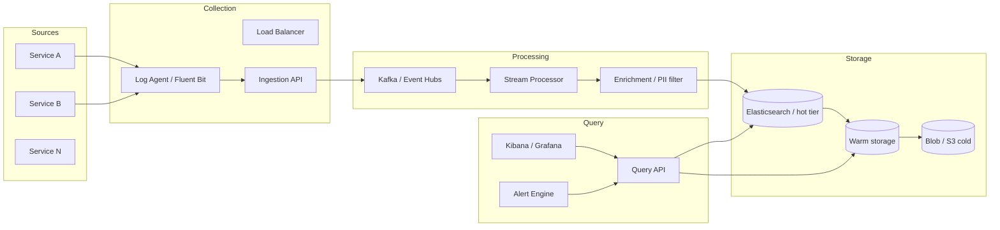

# Cas d'étude — Système de logs distribués

> **Exercice :** travaillez les 5 étapes **avant** de lire les sections « Solution de référence ».

---

## Énoncé

Concevez une plateforme de **centralisation de logs** pour des milliers de microservices :

- Collecte de logs applicatifs (JSON structuré)
- Recherche full-text et par champs (`service`, `level`, `traceId`, `userId`)
- Dashboards et alertes sur patterns (erreurs, latence)
- Rétention différenciée (7 j hot, 90 j warm, 1 an cold)
- Volume élevé, coût maîtrisé

**Comparable à :** ELK Stack (Elasticsearch, Logstash, Kibana), Azure Log Analytics, Datadog Logs, Grafana Loki.

**Hors scope :** métriques et traces (module 6), SIEM complet.

---

## Étape 1 — Clarification

### Questions à poser

1. Volume de logs / jour ? Taille moyenne d'une ligne ?
2. Nombre de services sources ?
3. Latence acceptable ingestion → recherche ?
4. Qui consomme (dev, SRE, sécurité) ?
5. Données sensibles (PII) dans les logs ?
6. Multi-région ?

### Hypothèses de référence

| Paramètre | Valeur |
| --------- | ------ |
| Services | 2 000 microservices |
| Instances totales | 20 000 |
| Logs / instance / seconde | 10 (moyenne) |
| Taille ligne JSON | 1 Ko |
| Rétention hot (recherche rapide) | 7 jours |
| Rétention totale | 1 an |
| Requêtes recherche | 500 / minute (analystes + alertes) |
| Ingestion → indexé | < 60 s p95 |

---

## Étape 2 — Estimation

### Volume ingestion

```text
20 000 instances × 10 logs/s = 200 000 logs/s
200k × 1 Ko = 200 Mo/s = ~17 To/jour brut
```

### Stockage

```text
Hot 7j  : 17 To × 7 ≈ 120 To
1 an    : 17 To × 365 ≈ 6 Po (compression ~5× → ~1,2 Po effectif)
```

### Recherche

```text
500 req/min ≈ 8 req/s — faible vs ingestion
→ le défi est l'**écriture** et le **stockage**, pas la lecture QPS
```

---

## Étape 3 — High-level design

### Solution de référence



### Flux ingestion

```text
1. App écrit JSON sur stdout (structured logging)
2. Fluent Bit (sidecar ou daemonset K8s) collecte
3. Batch + compress → Ingestion API (ou direct Kafka)
4. Kafka partition par service_name (ou hash)
5. Processor : parse, enrichit (k8s metadata), filtre PII
6. Bulk index Elasticsearch (refresh interval 5–30 s)
```

---

## Étape 4 — Deep dive

### 4.1 Choix Elasticsearch vs Loki vs Azure Log Analytics

| Critère | Elasticsearch | Loki | Log Analytics |
| ------- | ------------- | ---- | ------------- |
| Recherche full-text | ★★★★★ | ★★★ (labels) | ★★★★ (KQL) |
| Coût volume | Élevé | Plus faible | Variable |
| Ops | Lourd (shards) | Plus léger | Managé |
| Écosystème | ELK mature | Grafana natif | Azure natif |

**Pour ce cas (full-text, 17 To/j) :** Elasticsearch avec ILM (Index Lifecycle Management) ou solution managée (Elastic Cloud, Azure).

### 4.2 Partitionnement Kafka

```text
Topic: logs-raw
Partitions: 100+ (parallélisme consumers)
Key: service_name → ordre par service préservé
Retention Kafka: 24–72 h (buffer, pas archive long terme)
```

### 4.3 Index Lifecycle Management (ILM)

```text
Phase hot   (0–7j)   : replicas 1, SSD, recherche rapide
Phase warm  (7–90j)  : shrink, forcemerge, moins de replicas
Phase cold  (90j–1a) : mount searchable snapshots ou Blob
Phase delete (> 1a)  : suppression
```

### 4.4 Schéma de log standardisé

```json
{
  "timestamp": "2025-06-25T10:00:00.000Z",
  "level": "ERROR",
  "service": "order-api",
  "traceId": "abc123",
  "spanId": "def456",
  "message": "Payment failed",
  "orderId": "ord-789",
  "exception": "..."
}
```

**Index template :** `keyword` pour filtres, `text` pour message, pas d'index sur champs à haute cardinalité inutiles.

### 4.5 PII et coût

```text
Pipeline :
  - Masquer email, IP (hash), numéros carte (regex)
  - Sampling DEBUG en prod (1 % si volume excessif)
  - Drop health check logs (/health 200)
```

### 4.6 Alerting

```kql
level == "ERROR" AND service == "payment-api"
| where timestamp > ago(5m)
| summarize count() by bin(timestamp, 1m)
| where count_ > 100
```

Alert → PagerDuty / Teams via Alert Engine (Elastalert, Azure Monitor, Grafana).

---

## Étape 5 — Trade-offs

| Décision | Choix | Alternative | Justification |
| -------- | ----- | ----------- | ------------- |
| Transport | Kafka buffer | Direct ES bulk | Absorbe pics, replay |
| Index | Elasticsearch ILM | Tout en Blob | Recherche hot nécessaire |
| Agent | Fluent Bit sidecar | App push HTTP | Découple app du pipeline |
| Format | JSON structuré | Texte libre | Requêtes champs, alerting |
| PII | Filtrage pipeline | Tout indexer | RGPD, coût index |

### Évolutions

| Besoin | Évolution |
| ------ | --------- |
| 10× volume | Plus partitions Kafka, data stream ES, sampling |
| Corrélation traces | OpenTelemetry logs ↔ traces (même traceId) |
| Sécurité | RBAC par équipe/service, audit accès logs |

---

## Exercices

1. Recalculez le volume pour **2 000 logs/s** (startup) vs **2M logs/s** (hyperscale).
2. Pourquoi indexer `traceId` en **keyword** et `message` en **text** ?
3. Un shard Elasticsearch atteint **50 Go** : problème ? Action ?
4. Concevez la **politique de rétention** si la conformité exige 7 ans d'archive légale.

<details>
<summary>Pistes</summary>

1. Startup : ~170 Mo/j ; Hyperscale : ~170 To/j — architectures différentes (managed vs self-serve)
2. keyword = filtre exact, agrégation ; text = analyse full-text tokenisé
3. Recovery lente, relocation longue → shrink, rollover index, max 30–50 Go/shard guideline
4. Cold Blob immuable (WORM), pas de recherche interactive, restore procédure documentée

</details>

---

## Comparaison avec module 6

| Module 6 | Module 8 (ce cas) |
| -------- | ----------------- |
| App Insights par app | Plateforme logs **centralisée** multi-services |
| APM, métriques, traces | Focus **ingestion massive** + recherche |
| Azure natif | Pattern ELK / Kafka générique |

---

## Suite

- [WhatsApp](whatsapp.md) · [Uber](uber.md) · [Paiement](payment.md)
- [Projet final](../../project/README.md)
