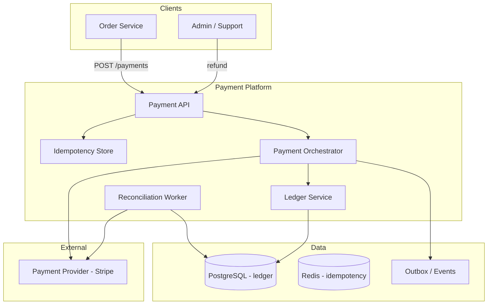

# Cas d'étude — Système de paiement

> **Exercice :** travaillez les 5 étapes **avant** de lire les sections « Solution de référence ».

---

## Énoncé

Concevez un **système de paiement** interne pour une plateforme e-commerce permettant :

- Débiter une carte bancaire ou un wallet interne
- Rembourser totalement ou partiellement
- Garantir qu'un paiement n'est jamais débité deux fois (idempotence)
- Historique et réconciliation comptable
- Intégration avec un prestataire externe (Stripe / Adyen)

**Hors scope :** émission de cartes, crypto, change de devises complexe.

---

## Étape 1 — Clarification

### Questions à poser

1. Volume de transactions / jour ? Montant moyen ?
2. Quels moyens de paiement (carte, wallet, virement) ?
3. Réglementation PCI-DSS : stockez-vous des numéros de carte ?
4. Délai d'autorisation vs capture (immédiat ou différé) ?
5. Taux d'échec acceptable ? Retry automatique ?
6. Multi-devises ?

### Hypothèses de référence

| Paramètre | Valeur |
| --------- | ------ |
| Transactions / jour | 5 millions |
| Montant moyen | 50 € |
| Pic | 3× moyenne (Black Friday) |
| Moyens | Carte (80 %), wallet interne (20 %) |
| PCI | Pas de PAN stocké — tokenisation prestataire |
| Modèle | Authorize + Capture (capture à l'expédition) |
| Disponibilité | 99,99 % |
| Cohérence | ACID forte sur ledger interne |

---

## Étape 2 — Estimation

### Throughput

```text
5M / 86400 ≈ 58 txn/s moyenne
Pic ≈ 175 txn/s
```

Modeste en QPS — la **complexité** est la cohérence et la conformité, pas le volume brut.

### Stockage ledger (5 ans)

```text
5M × 365 × 5 = 9,125 milliards lignes
~ 500 B/ligne → ~4,5 Po (ordre de grandeur)
→ archivage froid, partition par mois, agrégats comptables
```

---

## Étape 3 — High-level design

### Solution de référence



### Flux paiement (authorize + capture)

```text
1. Order Service : POST /payments
   Headers: Idempotency-Key: order-123-pay
   Body: { orderId, amount, currency, paymentMethodToken }

2. Payment API :
   a. Vérifie idempotency key (Redis + DB) → si existe, retourne résultat précédent
   b. Crée Payment status=PENDING

3. Orchestrator :
   a. Appelle PSP authorize(token, amount)
   b. Si succès : Ledger double-entry, status=AUTHORIZED
   c. Si échec : status=FAILED, raison

4. À l'expédition : POST /payments/{id}/capture
   → PSP capture → status=CAPTURED

5. Event PaymentCompleted → Order Service (outbox)
```

---

## Étape 4 — Deep dive

### 4.1 Ledger à double entrée

Chaque mouvement = 2 lignes (débit + crédit), somme = 0.

```text
Paiement 50 € capturé :
  DEBIT  customer_wallet     50 €
  CREDIT merchant_payable    50 €

Commission plateforme 2 € :
  DEBIT  merchant_payable     2 €
  CREDIT platform_revenue     2 €
```

**Table `ledger_entries` (append-only, immuable) :**

```sql
id, transaction_id, account_id, amount, currency, type, created_at
-- Jamais UPDATE/DELETE — corrections = entrées compensatoires
```

### 4.2 Idempotence

```text
Clé : Idempotency-Key (UUID fourni par client)
Stockage : Redis (TTL 24h) + table payments (unique constraint)

Flux :
  IF key exists → return stored response (même status HTTP)
  ELSE process + store response atomically
```

**Critique :** retry réseau Order → Payment ne doit jamais double-débiter.

### 4.3 Intégration PSP et PCI

```text
❌ Jamais : PAN, CVV dans votre DB
✅ Token PSP (pm_xxx Stripe) créé côté client (Elements / Checkout)
✅ Votre API ne voit que le token
```

**Scope PCI :** SAQ A si tout passe par hosted fields / redirect PSP.

### 4.4 Réconciliation

Batch nocturne :

```text
1. Télécharger rapport PSP (settlements)
2. Comparer avec ledger CAPTURED du jour
3. Écarts → alerte finance + file manuelle
```

États : `PENDING`, `AUTHORIZED`, `CAPTURED`, `REFUNDED`, `FAILED`, `DISPUTED`.

### 4.5 Remboursement

```test
POST /payments/{id}/refund { amount, reason }
  → Vérifie amount <= captured - already_refunded
  → PSP refund API
  → Ledger entrées inverses
  → Idempotency key obligatoire
```

---

## Étape 5 — Trade-offs

| Décision | Choix | Alternative | Justification |
| -------- | ----- | ----------- | ------------- |
| Cohérence | ACID SQL ledger | Event sourcing seul | Finance exige précision |
| Idempotence | Redis + DB unique | Redis seul | Durabilité si Redis flush |
| Auth/Capture split | Oui | Capture immédiate | Stock non expédié → pas de débit définitif |
| PSP | Stripe/Adyen | Propre acquéreur | Conformité, time-to-market |
| Async notification | Outbox → Order | Sync only | Résilience si Order down |

### Évolutions

| Besoin | Évolution |
| ------ | --------- |
| Multi-région | Ledger par région, réconciliation globale |
| Wallet interne | Compte utilisateur dans ledger, pas de PSP |
| Fraude | Service scoring (ML) avant authorize |

---

## Exercices

1. Dessinez le diagramme de séquence : paiement réussi avec retry réseau (même Idempotency-Key).
2. Un remboursement partiel de 20 € sur commande 50 € : quelles lignes ledger ?
3. Comment détecter un **double capture** côté bug applicatif ?
4. Quel **Saga** si Order annulée après authorize mais avant capture ?

<details>
<summary>Pistes</summary>

1. Client retry → API voit key → retourne 200 + même payment_id sans appel PSP
2. DEBIT merchant_payable 20, CREDIT customer_wallet 20 (+ entrée PSP mirror)
3. Contrainte unique `payment_id` + status state machine + audit log PSP
4. Saga : CancelOrder → ReleaseAuthorization (void PSP) → compenser réservation stock

</details>

---

## Conformité — checklist

| ✓ | Exigence |
| - | -------- |
| ☐ | Pas de PAN/CVV stockés |
| ☐ | TLS 1.2+ partout |
| ☐ | Idempotency sur toutes mutations |
| ☐ | Ledger append-only |
| ☐ | Audit trail (qui, quand, quoi) |
| ☐ | Réconciliation PSP quotidienne |
| ☐ | 3D Secure / SCA (Europe) |

---

## Suite

- [WhatsApp](whatsapp.md) · [Uber](uber.md) · [Logs](logging.md)
