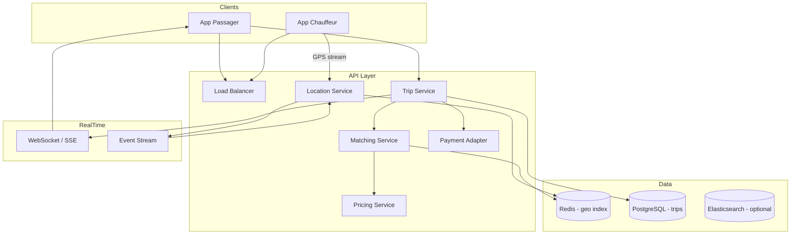

# Cas d'étude — Plateforme VTC (type Uber)

> **Exercice :** travaillez les 5 étapes **avant** de lire les sections « Solution de référence ».

---

## Énoncé

Concevez une plateforme de **transport avec chauffeur** (VTC) permettant :

- Un passager demande une course (origine, destination)
- Le système assigne un chauffeur disponible à proximité
- Suivi temps réel de la position du chauffeur sur la carte
- Estimation du prix et du temps d'arrivée (ETA)
- Paiement à la fin de course (intégration externe)

**Hors scope :** covoiturage, livraison nourriture, flotte autonome.

---

## Étape 1 — Clarification

### Questions à poser

1. Combien de courses / jour ? Combien de chauffeurs actifs ?
2. Zones géographiques (une ville, un pays, mondial) ?
3. Matching automatique ou choix du chauffeur par le passager ?
4. Fréquence de mise à jour GPS ?
5. Tolérance si aucun chauffeur disponible ?
6. Courses planifiées ou immédiates seulement ?

### Hypothèses de référence

| Paramètre | Valeur |
| --------- | ------ |
| Courses / jour | 10 millions |
| Chauffeurs actifs / jour | 2 millions |
| Passagers DAU | 20 millions |
| Mise à jour position chauffeur | 1 / 4 secondes quand en course, 1 / 30 s disponible |
| Zone | Multi-villes, partition géographique |
| Latence matching | < 5 s p95 |
| Latence affichage carte | < 2 s |

---

## Étape 2 — Estimation

### Courses par seconde

```text
10M / 86400 ≈ 116 courses/s (moyenne)
Pic (× 5, heures de pointe) ≈ 580 courses/s
```

### Mises à jour GPS

```text
Chauffeurs en course (~30 % peak) : 600k × 1/4s = 150k updates/s
Chauffeurs disponibles : 1,4M × 1/30s ≈ 47k updates/s
Total ≈ 200k events/s position (ordre de grandeur)
```

### Stockage positions

```text
Positions éphémères — pas d'historique long terme en hot storage
Historique course : origine, destination, trace simplifiée → DB après course
```

---

## Étape 3 — High-level design

### Solution de référence



### Flux demande de course

```text
1. Passager : POST /trips { pickup, dropoff }
2. Trip Service crée trip status=REQUESTED
3. Matching Service :
   a. Query chauffeurs disponibles dans rayon R (geo index)
   b. Filtre par critères (note, type véhicule)
   c. Notifie chauffeurs candidats (push)
4. Premier chauffeur qui accepte → status=ACCEPTED
5. WebSocket : position chauffeur streamée au passager
6. Fin course → Pricing → Payment → trip COMPLETED
```

---

## Étape 4 — Deep dive

### 4.1 Index géospatial

**Problème :** trouver les N chauffeurs les plus proches en < 100 ms parmi des milliers dans une zone.

| Approche | Détail |
| -------- | ------ |
| **Geohash + Redis** | `GEOADD drivers:paris:geohash_prefix` → `GEORADIUS` |
| **Quadtree** | En mémoire par ville, partition par cellule |
| **Google S2 / H3** | Index hexagonal Uber (H3) — uniformité |

```text
Requête matching :
  GEORADIUS drivers:city_75 48.8566 2.3522 3 km COUNT 20 ASC
  → liste driver_ids triés par distance
```

**Partitionnement :** une shard Redis (ou cluster) par **ville / région** — pas de requête globale.

### 4.2 Matching et concurrence

```text
Course C1 notifie chauffeurs D1, D2, D3
D1 accepte en premier → transaction atomique :
  UPDATE driver SET status=BUSY WHERE id=D1 AND status=AVAILABLE
  Si 0 rows → déjà pris, essayer suivant
```

**Surge pricing :** ratio demande/offre par zone → multiplicateur prix (Pricing Service lit métriques Redis).

### 4.3 Streaming position

```text
Chauffeur → Location Service (gRPC/UDP léger)
         → Kafka topic locations (partition par city_id)
         → Consumers :
              - Met à jour Redis geo index
              - Push WebSocket passager si course active
```

**Optimisation :** ne pas persister chaque point GPS — buffer en mémoire, snapshot toutes les 30 s en DB pour la course.

### 4.4 ETA et pricing

```text
ETA = ML model( distance routière, trafic temps réel, historique )
      ou API externe (Google Maps)

Pricing = base + (distance × rate) + (time × rate) × surge_multiplier
```

Service séparé, cache des matrices distance par zone.

---

## Étape 5 — Trade-offs

| Décision | Choix | Alternative | Justification |
| -------- | ----- | ----------- | ------------- |
| Geo index | Redis GEORADIUS | PostGIS seul | Latence mémoire, scale horizontal |
| Matching | Notify plusieurs, premier accepte | Dispatch central optimisé | Simple, résilient |
| Positions | Stream Kafka | Écriture directe DB | Découple, absorbe pics |
| Trip state | SQL ACID | NoSQL | Cohérence statut course critique |
| Real-time client | WebSocket | Polling 2s | UX carte fluide |

### Évolutions

| Besoin | Évolution |
| ------ | --------- |
| Matching optimal (pas premier arrivé) | Algorithme hongrois / batch matching par zone |
| Multi-région | Cellules géo indépendantes, pas de matching cross-région |
| Fraude GPS | Détection anomalies, corrélation capteurs |

---

## Exercices

1. Estimez la **mémoire Redis** pour 2M chauffeurs (position + metadata ~ 200 octets/chauffeur).
2. Que se passe-t-il si le **Matching Service** tombe pendant 2 minutes ?
3. Concevez le **diagramme d'états** d'une course (REQUESTED → … → COMPLETED).
4. Comment gérer **plusieurs villes** avec des équipes opérationnelles distinctes ?

<details>
<summary>Pistes</summary>

1. 2M × 200 B ≈ 400 Mo par shard géo (hors index) — plusieurs shards par pays
2. Courses en REQUESTED timeout après 60 s, retry ; chauffeurs non impactés ; file de demandes
3. REQUESTED → ACCEPTED → ARRIVED → IN_PROGRESS → COMPLETED / CANCELLED
4. Partition `city_id` dans tous les services, config pricing par ville, déploiement régional

</details>

---

## Suite

- [WhatsApp](whatsapp.md) · [Paiement](payment.md) · [Logs](logging.md)
