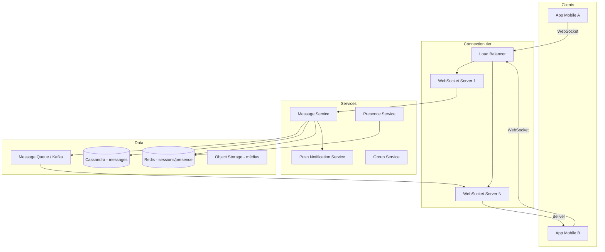

# Cas d'étude — Messagerie instantanée (type WhatsApp)

> **Exercice :** travaillez les 5 étapes **avant** de lire les sections « Solution de référence ».

---

## Énoncé

Concevez un système de **messagerie instantanée** mobile permettant :

- Envoi de messages texte 1:1 et en groupe
- Statut en ligne / hors ligne / « en train d'écrire »
- Accusés de lecture (double check)
- Historique des conversations sur plusieurs appareils
- Notifications push si l'app est fermée

**Hors scope initial :** appels vocaux/vidéo, paiements, stories.

---

## Étape 1 — Clarification

### Questions à poser

1. Combien d'utilisateurs actifs (DAU) ? Dans quelles régions ?
2. Taille max d'un groupe ? Taille max d'un message ?
3. Chiffrement bout-en-bout obligatoire ?
4. Durée de rétention des messages sur les serveurs ?
5. Médias (images) dans le MVP ou phase 2 ?
6. Latence cible pour la livraison d'un message ?

### Hypothèses de référence

| Paramètre | Valeur |
| --------- | ------ |
| DAU | 500 millions |
| Messages / utilisateur / jour | 50 |
| % messages groupe (3 personnes en moyenne) | 20 % |
| Taille moyenne message texte | 500 octets |
| Utilisateurs connectés simultanément (pic) | 50 millions |
| Rétention serveur | 30 jours (E2E : serveur stocke du chiffré) |
| Latence livraison | < 500 ms p95 |
| Disponibilité | 99,99 % |

---

## Étape 2 — Estimation

### Messages par jour

```text
500M × 50 = 25 milliards messages/jour

Répartition :
  80 % 1:1  = 20B messages
  20 % groupe (fan-out × 3) = 5B × 3 = 15B livraisons
  Total livraisons ≈ 35 milliards/jour
```

### Throughput

```text
35B / 86400 ≈ 405 000 messages/s (moyenne)
Pic (× 3)   ≈ 1,2 million messages/s
```

### Stockage (30 jours, texte seul)

```text
25B × 500 B × 30 j ≈ 375 Po sur 30 jours (ordre de grandeur élevé)
→ compression, E2E (serveur ne stocke pas en clair), tiering, politique rétention
→ en pratique : médias sur objet storage séparé, métadonnées en DB distribuée
```

### Connexions WebSocket (pic)

```text
50M connexions simultanées
→ dizaines de milliers de serveurs de connexion (≈ 5 000–10 000 connexions/serveur)
```

---

## Étape 3 — High-level design

### Solution de référence



### Flux envoi message 1:1

```text
1. A envoie message via WebSocket → serveur connexion A
2. Message Service :
   a. Persiste (Cassandra, clé conversation)
   b. Publie sur topic Kafka (partition par conversation_id)
3. Si B en ligne : serveur connexion B consomme → push via WebSocket
4. Si B offline : Push Service (APNs/FCM) + message en attente
5. Accusé « livré » → « lu » via événements retour
```

### Identification utilisateur → serveur

```text
User ID → hash(user_id) % N → serveur de connexion préféré
Session token validé à la connexion WebSocket
```

---

## Étape 4 — Deep dive

### 4.1 Gestion des connexions WebSocket

| Défi | Solution |
| ---- | -------- |
| 50M connexions | Ferme de serveurs dédiés (Erlang/Elixir, Go, ou custom) |
| Sticky routing | LB route par user_id vers même nœud |
| Heartbeat | Ping/pong 30 s, déconnexion si timeout |
| Reconnexion | Client backoff + récupère messages manqués via API REST |

**Pourquoi pas HTTP polling ?** Latence, charge serveur, batterie mobile.

### 4.2 Stockage des messages

**Modèle Cassandra (wide column) :**

```sql
PRIMARY KEY ((conversation_id), message_id)
```

- Toutes les messages d'une conversation sur même partition → lecture chronologique efficace
- `message_id` = Snowflake ID (tri temporel)

**Groupe :** fan-out on write pour petits groupes (< 100), fan-out on read pour très grands groupes / canaux.

### 4.3 Présence et « en train d'écrire »

```text
Redis : user:{id}:status = online | last_seen_ts
TTL heartbeat : 60 s

Typing indicator : pub/sub Redis channel conversation:{id}
  → pas de persistance, éphémère
```

**Trade-off :** présence approximative acceptable (AP) — mieux vaut afficher « en ligne » avec léger retard que bloquer.

### 4.4 Chiffrement E2E (option)

```text
Serveur ne voit que metadata + blob chiffré
Clés échangées via Signal Protocol (X3DH + Double Ratchet)
→ impossible de déchiffrer côté serveur, modère modération
```

---

## Étape 5 — Trade-offs

| Décision | Choix | Alternative | Justification |
| -------- | ----- | ----------- | ------------- |
| Transport temps réel | WebSocket | Long polling | Latence, efficacité |
| Fan-out groupes | Write (petits) / Read (grands) | Toujours write | Évite explosion stockage célébrités |
| Stockage messages | Cassandra | SQL | Scale write, partition naturelle |
| Présence | Redis AP | DB synchrone | Disponibilité > précision |
| Livraison offline | Push + queue | SMS fallback | Coût, UX |
| Ordre des messages | Par conversation (partition Kafka) | Ordre global | Impossible à scale |

### Évolutions

| Besoin | Évolution |
| ------ | --------- |
| 10× charge | Plus de partitions Kafka, shards Cassandra |
| Médias | Blob storage + CDN, thumbnail async |
| Multi-région | Réplication geo, utilisateurs routés par région |
| Recherche messages | Index Elasticsearch async |

---

## Exercices

1. Recalculez le throughput pour **100M DAU** au lieu de 500M.
2. Un groupe de **500 000** membres reçoit un message : fan-out write ou read ? Justifiez.
3. Dessinez le diagramme de séquence : envoi message, destinataire offline, puis ouverture app.
4. Comment gérez-vous le **sync multi-appareils** (téléphone + tablette) ?

<details>
<summary>Pistes</summary>

1. ~80k msg/s moyenne, ~240k pic
2. Fan-out on read obligatoire — 500k écritures par message est prohibitif
3. Envoi → persist → push FCM → ack → client fetch REST `/messages?since=cursor`
4. Chaque appareil a `device_id`, cursor de lecture par conversation, WebSocket par device ou push sélectif

</details>

---

## Références

- Kleppmann — messagerie, partitionnement
- [System Design Primer — chat](https://github.com/donnemartin/system-design-primer)

## Suite

- [Uber](uber.md) · [Paiement](payment.md) · [Logs](logging.md)
