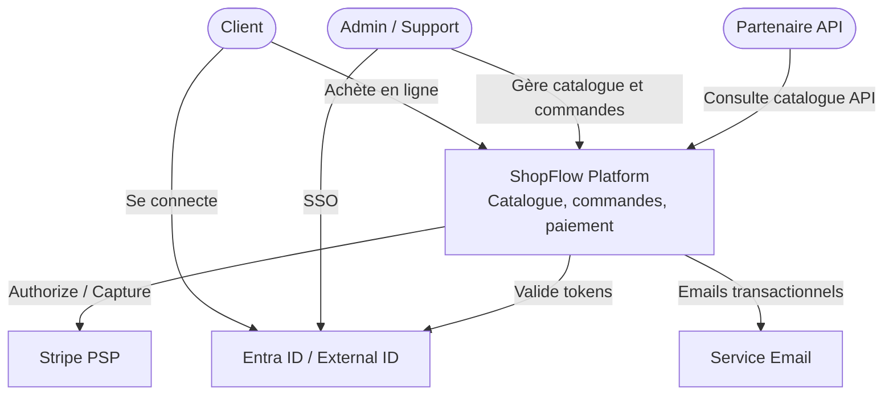
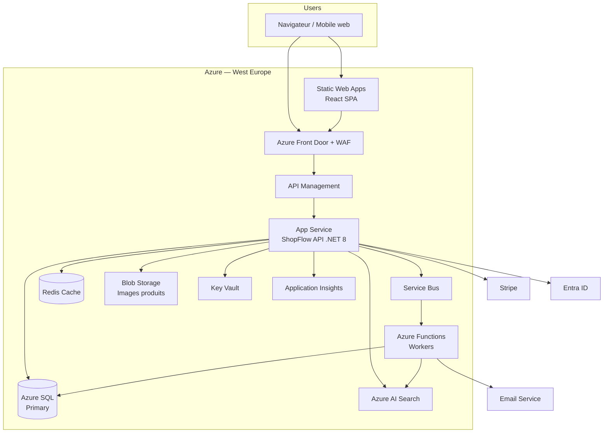
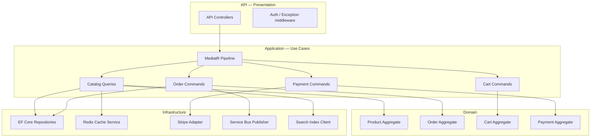
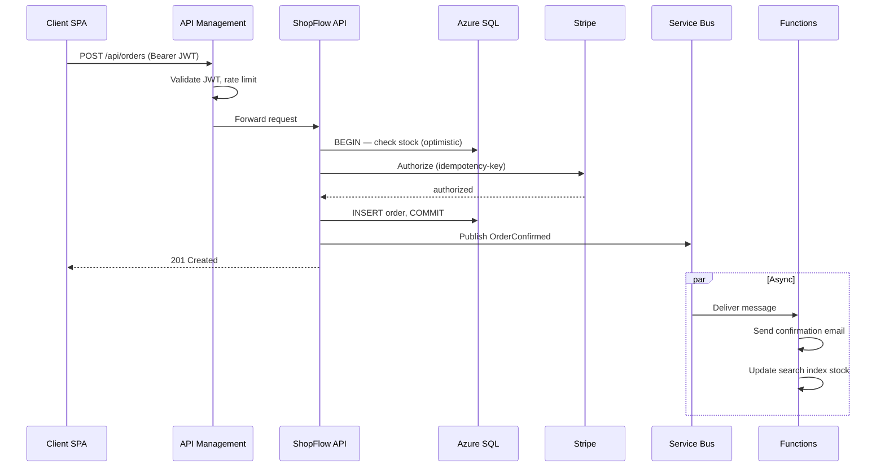
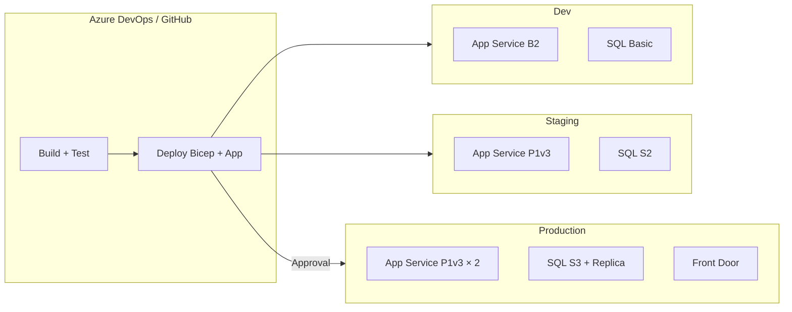

# Architecture ShopFlow — Diagrammes C4

Diagrammes de référence pour le projet final. Reproduisez-les dans Draw.io (`context-diagram.drawio`, `container-diagram.drawio`, `component-diagram.drawio`) si besoin d'édition visuelle.

---

## Niveau 1 — Context

Acteurs et systèmes externes.



---

## Niveau 2 — Container

Conteneurs applicatifs et mapping Azure.



### Mapping Azure

| Conteneur | Service Azure | SKU indicatif |
| --------- | ------------- | ------------- |
| SPA | Static Web Apps Standard | 1 app |
| Edge | Front Door Premium | WAF + CDN |
| Gateway | API Management | Standard 1 unit |
| API | App Service Linux | P1v3 × 2 |
| Workers | Functions Premium | EP1 |
| Messaging | Service Bus | Standard namespace |
| OLTP | Azure SQL | S3 + geo-replica |
| Cache | Azure Cache Redis | C1 Standard |
| Search | Azure AI Search | Basic |
| Médias | Blob Storage | Hot GRS |
| Secrets | Key Vault | Standard |
| Observabilité | Application Insights | Pay-as-you-go |

---

## Niveau 3 — Component

Composants internes de l'API (monolithe modulaire).



---

## Séquence — Création de commande



---

## Déploiement



---

## Flux de données — Catalogue

```
Lecture produit :
  Client → Front Door → APIM → API
    → Redis (hit ? return)
    → miss : SQL + remplissage Redis
    → Recherche : Azure AI Search (full-text)

Écriture produit (admin) :
  API → SQL → event ProductUpdated → Function → index Search + invalidation Redis
```

---

## Fichiers Draw.io

| Fichier | Contenu à y reporter |
| ------- | -------------------- |
| `context-diagram.drawio` | Diagramme Context |
| `container-diagram.drawio` | Container + services Azure |
| `component-diagram.drawio` | Composants API |

Export PNG recommandé pour inclusion dans le DAT ou les slides de soutenance.
