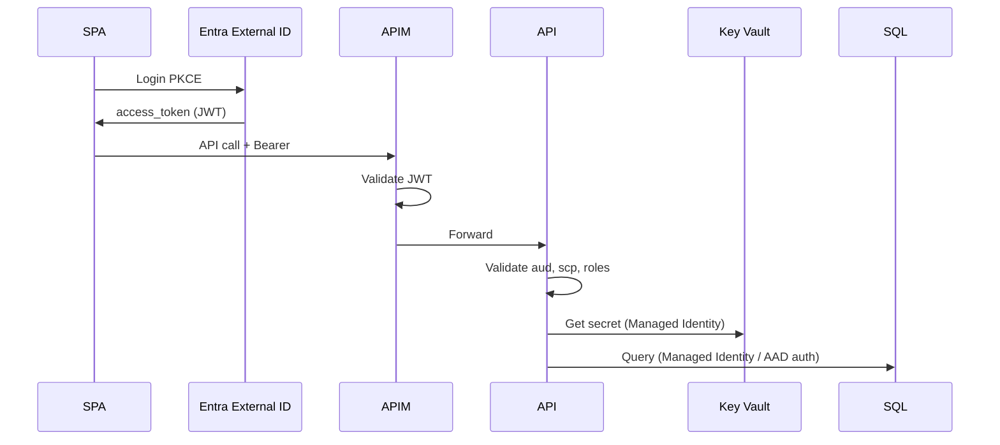

# Modèle de sécurité — ShopFlow

Synthèse pour le projet final — détail pédagogique dans [module 7](../../modules/07-security/).

---

## 1. Actifs et classification

| Actif | Classification | Stockage |
| ----- | -------------- | -------- |
| Compte client (PII) | Confidentiel | Azure SQL |
| Commandes / factures | Confidentiel | Azure SQL |
| Tokens paiement Stripe | Restreint | Stripe uniquement (pm_xxx) |
| Images produits | Interne | Blob Storage |
| Logs applicatifs | Interne | Log Analytics |
| Secrets infra | Restreint | Key Vault |

---

## 2. Authentification

### Clients (B2C)

| Élément | Choix |
| ------- | ----- |
| Protocole | OpenID Connect |
| IdP | Microsoft Entra External ID |
| Flux | Authorization Code + PKCE (SPA) |
| MFA | Optionnel MVP, obligatoire admin |

### Admins / support

| Élément | Choix |
| ------- | ----- |
| IdP | Entra ID workforce |
| MFA | Obligatoire |
| Accès | Conditional Access (IP corp, device compliant) |

### Partenaires API

| Élélement | Choix |
| ------- | ----- |
| Auth | APIM subscription key + OAuth client credentials |
| Rate limit | 1000 req/min par partenaire |

---

## 3. Autorisation (RBAC)

| Rôle Entra | Permissions |
| ---------- | ----------- |
| `Customer` | Son profil, ses commandes, son panier |
| `CatalogEditor` | CRUD produits |
| `SupportAgent` | Lecture commandes, remboursement |
| `PlatformAdmin` | Tous droits admin |

**BOLA :** chaque `GET/PATCH /orders/{id}` vérifie `order.CustomerId == token.oid` ou rôle support.

**Multi-tenant futur :** claim `extension_TenantId` + filtre SQL / RLS.

---

## 4. Flux sécurisé (résumé)

---

## 5. Contrôles réseau

| Contrôle | Implémentation |
| -------- | -------------- |
| WAF | Front Door OWASP 3.2 |
| TLS | 1.2+ obligatoire |
| SQL / Redis | Private Endpoints, pas d'IP publique |
| Admin API | IP restriction optionnelle via APIM |
| DDoS | Azure DDoS Protection (Standard si requis) |

---

## 6. Protection des données

| Donnée | Transit | Repos |
| ------ | ------- | ----- |
| API | HTTPS | — |
| SQL | TLS | TDE Azure SQL |
| Blob | HTTPS | Microsoft-managed keys ou CMK |
| PII | — | Minimisation, droit effacement documenté |

### PCI

- Stripe Elements / Checkout — **aucun PAN** sur serveurs ShopFlow
- Scope SAQ A visé

---

## 7. Gestion des secrets

| Secret | Emplacement |
| ------ | ----------- |
| Connection strings | Key Vault |
| Stripe API key | Key Vault |
| APIM keys | Key Vault / APIM native |
| Certificats TLS | Front Door / Key Vault |

Accès via **Managed Identity** — zéro secret dans Git ou App Settings en clair.

---

## 8. Audit et conformité

| Événement | Journalisé |
| --------- | ---------- |
| Login succès / échec | Entra sign-in logs |
| Changement rôle admin | Entra audit |
| Remboursement | App log + SQL audit table |
| Accès Key Vault | Key Vault diagnostic logs |

**RGPD :** registre traitements, DPA Microsoft, données UE, procédure effacement client.

---

## 9. Menaces principales (STRIDE)

| Menace | Mitigation |
| ------ | ---------- |
| Accès commande autrui (BOLA) | Ownership check systématique |
| Token forgé | Validation JWT Entra JWKS |
| Injection SQL | EF Core paramétré |
| Abus API | APIM rate limiting |
| Fuite secret Git | Gitleaks CI + révocation |
| XSS SPA | CSP, sanitization |

---

## 10. Plan de gouvernance (résumé)

| Processus | Fréquence |
| --------- | --------- |
| Revue accès Azure RBAC | Trimestrielle |
| Rotation secrets Stripe / APIM | Semestrielle |
| Pentest externe | Annuelle |
| Revue Defender for Cloud | Hebdomadaire |
| Formation dev sécurité | Onboarding |

Plan détaillé : voir gabarit [module 7](../../modules/07-security/governance.md).

---

## Références

- [DAT](../dat/DAT.md)
- [Requirements](../requirements.md)
