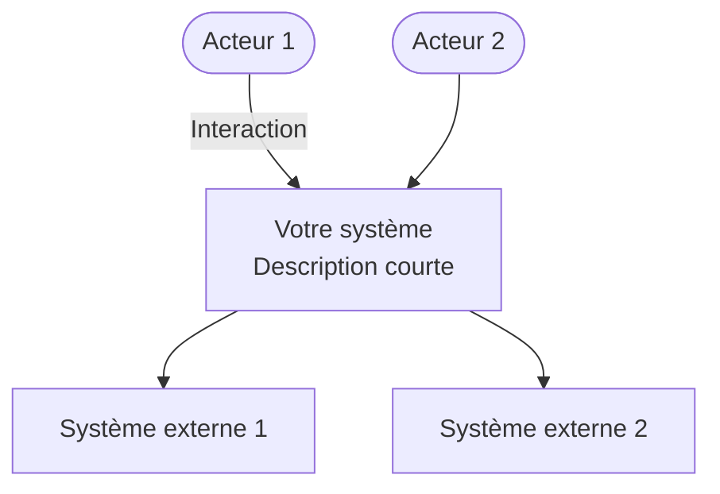
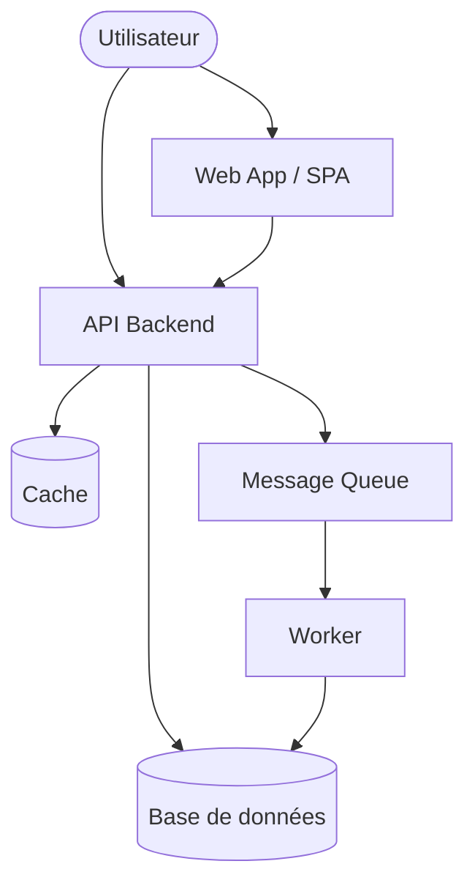
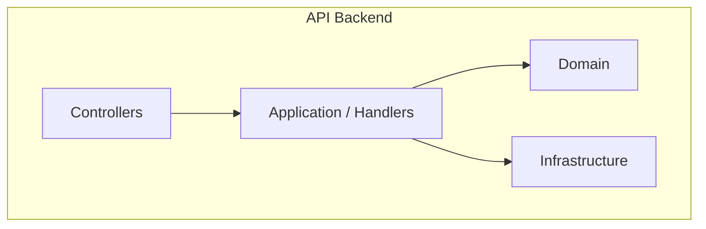

# Template — Modèle C4

Guide pour produire les diagrammes C4 du projet final ou des modules.

---

## Niveaux C4

| Niveau | Audience | Contenu |
| ------ | -------- | ------- |
| **1 — Context** | Tous | Système + acteurs + systèmes externes |
| **2 — Container** | Tech / archi | Applications, BDD, files, mapping infra |
| **3 — Component** | Développeurs | Modules internes d'un container |
| **4 — Code** | Dev (optionnel) | Classes — rarement en revue archi |

**Règle :** un diagramme = un niveau de zoom. Ne pas mélanger Context et Container.

---

## Niveau 1 — Context (gabarit)

**À documenter :**

- Qui utilise le système ?
- De quoi dépend-il (paiement, auth, email) ?

---

## Niveau 2 — Container (gabarit)

**À documenter :**

- Technologie par container (ex. App Service, Azure SQL)
- Protocoles (HTTPS, AMQP)

---

## Niveau 3 — Component (gabarit)

Zoom sur **un** container (souvent l'API).

---

## Bonnes pratiques

| Pratique | Détail |
| -------- | ------ |
| Légende | Couleurs : interne vs externe |
| Nommage | Noms métier, pas que techniques |
| Flèches | Verbes sur les relations (« commande », « authentifie ») |
| Cohérence | Mêmes noms entre Context et Container |
| Export | Draw.io, Mermaid, ou Structurizr |

---

## Exemple complet

Projet final ShopFlow : [project/architecture/README.md](../project/architecture/README.md)

---

## Outils

| Outil | Lien |
| ----- | ---- |
| Draw.io | <https://app.diagrams.net> |
| Mermaid | <https://mermaid.js.org> |
| C4 model | <https://c4model.com> |
| Structurizr | <https://structurizr.com> |
